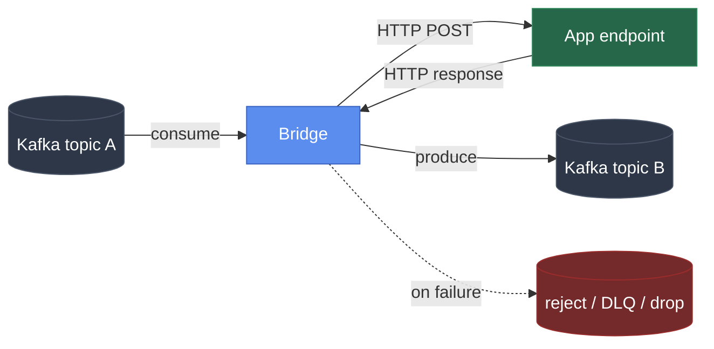
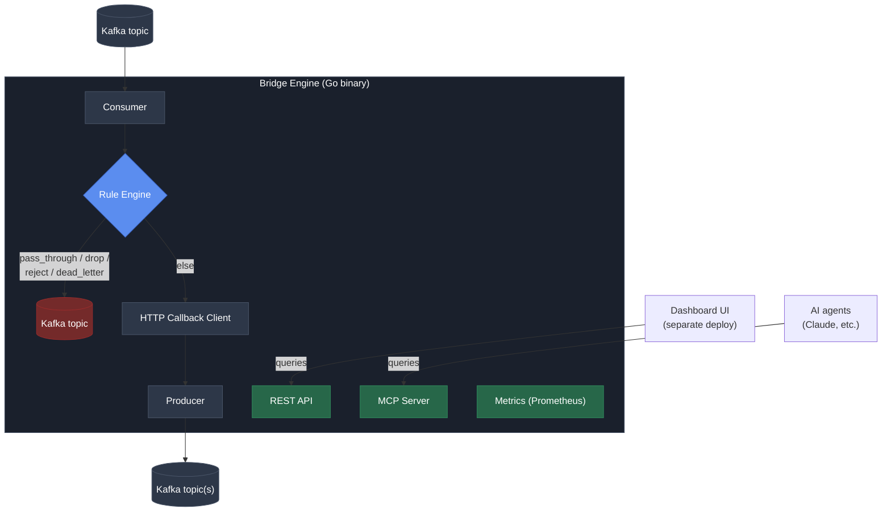

# Kafka Callback Bridge: Project Plan

> Config-driven middleware that connects Kafka topics to plain HTTP apps
> (consume, validate/route, callback, produce), with an MCP interface
> so AI agents can operate it, deployed as an open-source, self-hosted tool.

Owner: ekdanai.kk@gmail.com
License: Apache License 2.0
Status: Phases 1 to 5 and 4b (cluster v1) done, Phase 6 core done.
A full review on 2026-09-24 found message-loss and auth gaps, tracked in
"Phase 0: Hardening" at the top of §6. All of Phase 0 except T1
(batching, deliberately deferred) is fixed and verified live, and
cluster v2 (Phase 4c) is built. Next: MCP config tools, then the UI.
CI (`.github/workflows/ci.yml`) runs build/vet/test, govulncheck,
gosec, Semgrep, OSV-Scanner, Gitleaks, and a Trivy image scan on
every PR.

---

## 1. Problem statement

Teams that already have working apps (any language) want to plug into
Kafka without every team writing its own Kafka consumer/producer code,
handling retries, dead-lettering, offset commits, and rebalances by hand.

**The Bridge** sits between Kafka and an app's existing HTTP endpoint:



The app never touches a Kafka client library. It just implements one
HTTP endpoint it already knows how to build.

Kafka topic A on the left is also the Bridge's queue, the same role
NiFi's inter-processor connections play. Pausing or stopping a
pipeline doesn't drop anything: messages just sit in that topic,
bounded by its retention setting, until consumption resumes. Since the
queue lives in Kafka rather than on any Bridge instance's own disk, a
Bridge node crashing mid-message doesn't touch it either. The offset
for that message was never committed (commit only happens after a
successful produce), so it's simply redelivered to whichever Bridge
node picks up that partition next.

An earlier version did not fully meet that guarantee: a message whose
processing ended in an error could be committed past by the next
successful message on its partition and lost. Fixed in Phase 0, H1: a
message that can't be completed is now retried in place, and nothing
after it on its partition is committed until it is.

## 2. Non-goals (v1)

- Not a general-purpose iPaaS, not competing with n8n, Camel, or
  Zapier on breadth of connectors. Scope stays Kafka-native and
  HTTP-callback-shaped. Since 2026-09-26 a pipeline can be a flow of
  steps joined in any shape (Phase 9), so the path inside one pipeline is
  as free as a workflow tool's, but what goes in is still a Kafka topic
  and what comes out is still topics and HTTP.
- Not a hosted/managed service. Self-hosted, single binary or Docker
  image, operator controls their own uptime.
- Not a new storage/database engine. Uses Kafka itself as the buffer,
  no custom persistence layer in v1.

## 3. Differentiation (why build this vs. existing tools)

| Existing tool | Gap it leaves |
|---|---|
| Kafka Connect | Powerful but heavy. Needs a Connect cluster, JVM, custom connector code for anything off the beaten path. |
| Strimzi/AMQ HTTP Bridge | Protocol translator (HTTP↔Kafka RPC-style), not an orchestrator. Each instance pins consumer state in memory and doesn't scale horizontally well for this pattern. |
| n8n / Camel / Benthos | General-purpose, hundreds of connectors, heavier to deploy and reason about for a single narrow pattern. |

**Our bet:** be the smallest, most opinionated tool that does exactly
"consume, validate/route, callback, produce," with built-in
correlation IDs, retry, dead-lettering, and sticky-partition ordering.
Config in YAML, one binary, minutes to deploy. And give AI agents a
native way to operate it (MCP), which none of the above do today.

## 4. Architecture overview



Two additional interfaces sit alongside the REST API, both reading
from the same internal state (pipeline registry, metrics, DLQ store).
They're thin adapters, not separate sources of truth.

- **REST API**: for the Dashboard UI (separate deployable service).
- **MCP Server**: for AI agents (Claude Desktop, Claude Code, or any
  MCP-capable client) to inspect and operate the Bridge conversationally.

## 5. Core concepts / config schema

```yaml
pipelines:
  - name: order-processor
    tenant: team-a                      # for multi-team isolation/metrics
    mcp_access: read_write              # read_only | read_write | none (default: read_only)
    source_topic: orders.raw
    destination_topic: orders.processed
    dead_letter_topic: orders.dlq
    reject_topic: orders.rejected

    consumer_group: order-processor-group
    workers: 3                          # consumer-group members (goroutines) in this process
    consumer:
      max_poll_records: 50
      max_poll_interval_ms: 300000

    target:
      mode: single_url                  # or multi_url
      url: http://order-app:8080/process
      health_check_url: http://order-app:8080/health   # optional
      health_check_interval_seconds: 10                 # default when health_check_url is set
      # mode: multi_url
      # urls: [http://worker-1:8080/process, ...]
      # strategy: sticky_partition       # or round_robin, least_inflight

    concurrency:
      max_in_flight: 10

    retry:
      max_attempts: 3
      backoff_ms: 1000

    fast_path_rules:                    # evaluated before any HTTP callback
      - name: auto-approve-small-orders
        condition: "data.amount < 1000 && data.risk_score < 0.3"
        action: pass_through
      - name: invalid-missing-field
        condition: "data.customer_id == nil"
        action: reject
      - name: drop-test-data
        condition: "data.env == 'test'"
        action: drop
      - name: suspicious-fraud-flag
        condition: "data.risk_score > 0.9"
        action: dead_letter
```

Rule actions: `pass_through`, `reject`, `drop`, `dead_letter`. Anything
not matched by a rule falls through to the normal callback flow.

**Chaining pipelines.** There's no special "multi-stage pipeline"
feature, and none is needed for the common case of wanting several
processing stages. A `destination_topic` of one pipeline can simply be
the `source_topic` of another: `orders.raw` to pipeline A to
`orders.staged` to pipeline B to `orders.processed`. Each stage is an
ordinary entry in `pipelines:`, independently pausable/resumable and
independently observable in metrics. This covers "long, multi-step
pipelines" without any engine changes. See §6's Phase 3 extensions for
`post_callback_rules`, which covers the other half: smarter branching
*within* one stage, still without becoming a general DAG engine (see
§11 for why).

## 6. Phased roadmap

### Backend: Phase 0: Hardening (blocks production use)

Found by a full review of the code at HEAD on 2026-09-24 (code-review
on the cluster commit, code-review on the data path, security-review on
the whole engine), read against the code rather than this document.
Several earlier "done" claims below turned out to be only partly true;
each is cross-referenced here. Every item needs a regression test
and a live check against docker-compose Kafka before it is ticked.

**Data correctness (H, ship first):**
- [x] **H1. Failed messages are committed past and lost.**
      `commitInOrder` skips a failed job and then commits the next
      successful one, which moves the partition offset past the
      failure. Fix: a failed job must stop that partition from
      committing. Either rewind the reader to the failed offset and
      retry with backoff, or end the worker so it restarts from the
      last commit. Also refuse to start a pipeline without a
      `dead_letter_topic` unless it sets `on_exhausted: block`, so
      "exhausted retries with nowhere to put the message" is never a
      silent path.
- [x] **H2. Final commits use an already-cancelled context.** On
      stop, reload or shutdown, `CommitMessages(ctx)` fails instantly,
      so every in-flight message that already reached the destination
      is redelivered. Fix: drain with a separate bounded shutdown
      context (for example 10s) so completed work gets committed.
- [x] **H3. `Reconcile` is not serialized.** The file watcher, `POST
      /config/reload` and cluster placement updates can call it at the
      same time. Two concurrent starts orphan a full set of consumers
      that nothing can stop (duplicate processing until the process
      exits). Fix: one mutex held across the whole reconcile, and
      cluster placement goes through the same serialized path.
- [x] **H4. A failed restart leaves the pipeline stopped.** A changed
      pipeline is stopped before its new version is started; if the
      start fails (Kafka briefly unreachable), the pipeline stays down
      until someone edits the file again. Fix: start the new version
      first, or keep the old config and retry the start with backoff.
- [x] **H5. A fetch error kills a worker permanently.** `Run` returns
      and nothing restarts it, so the pipeline silently runs with fewer
      workers. Fix: supervise each runner and restart it with backoff.
- [x] **H6. Every topic ARK creates has replication factor 1.** DLQ,
      reject, source topics and all `__ark_*` cluster topics. One broker
      loss loses them. Fix: `topics.replication_factor` config (default
      3, capped at broker count), `min.insync.replicas` set to match,
      and stop auto-creating `source_topic` (in production it is owned
      by whoever produces to it).

**Security (S, ship with H):**
- [x] **S1. The REST API has no authentication.** Pause, resume,
      reload and DLQ retry/discard/read are open to anyone who can
      reach port 8080. That is also the port MCP agents are pointed
      at, so it bypasses both token scopes and per-pipeline
      `mcp_access` (a `none` pipeline's raw DLQ payloads are readable
      over REST). Fix: the same bearer-token middleware on REST (viewer
      for GET, operator for POST), apply `mcp_access` to REST too,
      default the listen address to `127.0.0.1`, and optionally a
      separate admin listener.
- [x] **S2. An MCP session is not bound to the token that opened it.**
      The scoped server is chosen only when a session is created, so a
      viewer token plus a leaked operator session ID gets operator
      tools. Fix: set `auth.TokenInfo` with a per-token user ID so the
      SDK rejects mismatched sessions.

**Behavior (B, before 1.0):**
- [x] **B1. 408, 425 and 429 are treated as permanent rejects.** A
      target that rate-limits during a burst sends messages straight to
      `reject_topic`. Fix: treat 408/425/429 like 5xx (retry with
      backoff, honor `Retry-After`), and make the reject status set
      configurable (`target.reject_statuses`, default 400, 404, 409,
      410, 422).
- [x] **B2. Per-key ordering is not preserved.** With `max_in_flight`
      above 1, messages from one partition run concurrently and can
      reach the destination out of order, which breaks the usual
      "created before paid" expectation. §3 even advertises ordering.
      Fix: `ordering: per_key` (default; messages sharing a key run one
      at a time, different keys in parallel), `per_partition`, or
      `none`.
- [x] **B3. Pause is lost on restart.** The pause flag lives in
      per-run state, so any reload or placement change resumes a
      pipeline an operator deliberately paused during an outage. Fix:
      persist pause state (see cluster v2 control topic, C1).
- [x] **B4. The DLQ browser forgets retries and discards.** It never
      commits and keeps state in memory, so after a restart retried or
      discarded entries come back and can be retried twice. Fix: keep
      entry state (retried/discarded) in a compacted topic and skip
      those on reload.
- [x] **B5. Callback timeout is hardcoded to 30s.** Make it
      `target.timeout_ms`.
- [x] **B6. Head-of-line blocking on commit.** One message stuck in
      retry holds back commits of every later message on the
      partition, so a crash at that moment redelivers a large batch.
      Document it, expose "oldest uncommitted age" as a metric, and let
      B2's per-key lanes limit the blast radius. Done:
      `ark_oldest_uncommitted_age_seconds` per worker.

**Found by a second code-review pass over the fixes themselves
(done):** with no DLQ, a 4xx or failure retried in place forever and
re-posted the callback each time (fixed by requiring
`dead_letter_topic` unless `on_exhausted: block`, with rejects falling
back to the DLQ); a worker could hang on a fetch error; "caught up" on a
compacted topic could never be reached once compaction removed the last
record (fixed with one shared tailer that uses reader lag and an idle
timeout); redrive missed pipelines not running on the leader; 408
didn't honor `Retry-After`; stale per-worker gauges; unbounded DLQ
state; and only the first broker was ever dialed.

**Found while fixing the above (done):**
- [x] **H7. Correlation ID changed on every attempt.** It was random per
      call, so a redelivered message reached the target with a new ID and
      could not be de-duplicated by it, which is the whole point of
      sending one. It is now derived from topic, partition and offset, so
      every retry and every redelivery carries the same ID.
- [x] **T0. Every produce waited up to 1s.** kafka-go's default
      `BatchTimeout` is 1s and every `Send` is synchronous, so each
      produce waited for the batch timer. Lowered to 5ms. Measured live:
      300 messages drained in about 1s instead of about 30s.
- [x] **Destination partitioning broke per-key order.** The producer
      used `LeastBytes`, so one key could land on different destination
      partitions. It now hashes by key.

Verification: every item above was checked against docker-compose Kafka,
not only unit tests. H1 was reproduced on the old binary first (a failed
message was committed past with lag 0 and never redelivered, even after
the target recovered and the process restarted), then shown fixed on the
new one, including a `kill -9` while the message was mid-retry. B1: the
old binary sent a 429'd message to `reject_topic`, the new one honored
`Retry-After` and delivered it. S1/S2: remote requests without a token get
401, a viewer can't pause, an MCP token is refused on REST, and an
operator session replayed with a viewer token gets 403.

**Throughput (T, when a real deployment needs it):**
- [ ] **T1. One HTTP call per message caps throughput.** Still open,
      and deliberately so for now: T0 removed the 1s-per-produce stall
      that was the real bottleneck (about 30x faster measured), and
      batching changes the callback contract (arrays in, per-item
      results out, partial failures), so it should wait for a
      deployment that actually needs more than the per-message ceiling. Ceiling is
      roughly `workers x max_in_flight / callback latency` (4 x 10 /
      50ms is about 800 msg/s). Add an optional batch mode
      (`target.batch_size`, `target.batch_linger_ms`) that posts an
      array and maps a per-item result array back.

### Backend: Phase 1: Core engine (MVP), done
- [x] Go module scaffold (`cmd/bridge`, `internal/...`)
- [x] Config loader (YAML to typed struct, validation)
- [x] Kafka consumer wrapper (single pipeline, single partition strategy)
- [x] HTTP callback client with correlation ID injection
- [x] Kafka producer wrapper (destination topic)
- [x] At-least-once semantics (commit offset only after produce succeeds)
- [x] Structured JSON logging with correlation ID
- **Exit criteria:** one pipeline, one topic in, one topic out, via HTTP
  callback, running locally against docker-compose Kafka. Verified end
  to end against live docker-compose Kafka.

### Backend: Phase 2: Reliability, done
- [x] Retry with backoff on callback failure/timeout
- [x] Retry with backoff on produce failure too (destination/DLQ/reject
      topics), not just the HTTP callback. Found by testing: a
      transient produce error was failing a message permanently for
      the running process instead of being retried.
- [x] Dead-letter topic on exhausted retries, but only for a
      message-specific failure (the destination is otherwise healthy
      and responding, this particular message's attempts all failed).
      When the circuit breaker is open, that's a destination-wide
      outage, not a bad message, so `process()` blocks in place
      re-checking the breaker instead of giving up. Nothing goes to
      DLQ during an outage; the message just sits in `source_topic`
      (already the queue, see §1) until the destination is reachable
      again.
- [x] Reject action (4xx callback response, non-retryable) routes to `reject_topic`
- [x] Concurrency limiter (max_in_flight) with in-order offset commit
- [x] Consumer pause/resume (`POST /api/v1/pipelines/{name}/pause|resume`,
      moved up from Phase 5 since it only needed the engine, not the
      full REST API)
- [x] Circuit breaker around the callback client
- [x] Optional `target.health_check_url`. While the breaker is open, a
      background probe periodically checks it and closes the breaker
      on success, so recovery doesn't depend on new traffic arriving
      to trigger a retry. Doubles as a way to wake a cold/sleeping
      destination using whatever health endpoint it already exposes.
- **Exit criteria:** a flaky/slow downstream app no longer causes
  message loss or unbounded queueing; DLQ and reject topics populate
  correctly. Verified: retries exhaust against a message-specific
  failure and DLQ populates; a destination-wide outage opens the
  breaker, messages block in place with zero commits,
  `target.health_check_url` closes the breaker without new traffic,
  and the whole backlog is genuinely retried (not skipped) once the
  destination is reachable again. A real bug was found and fixed
  here: an earlier version let a later message on the same partition
  commit past an unresolved earlier one, since Kafka's offset commit
  is a single resume pointer, not a per-message ledger. Skipping any
  offset at all silently drops it. **Only partly fixed:** the breaker
  path blocks correctly, but `commitInOrder` still `continue`s past a
  failed job, so a failure from a missing DLQ, exhausted produce
  retries, or a webhook override still got committed past. Fixed as
  Phase 0, H1.

### Backend: Phase 3: Rule engine (fast path), done
- [x] Expression evaluator (`expr-lang/expr`) wired to rule config.
      Conditions use `expr`'s own syntax, not JSON/JS: null checks are
      `data.field == nil`, not `== null` (`null` fails to compile).
      A message whose value isn't valid JSON simply matches no rule
      and falls through to the normal callback flow rather than erroring.
- [x] `pass_through` / `drop` / `reject` / `dead_letter` actions, plus
      `transform_route` (either `destination_override` to a different
      Kafka topic, or `webhook_override` to a different HTTP endpoint,
      not both)
- [x] Rule ordering (first match wins) and per-rule metrics
      (`ark_fast_path_rule_matches_total`,
      `ark_post_callback_rule_matches_total`, labeled by rule and action)
- [x] `post_callback_rules` implemented alongside `fast_path_rules`
      using the same evaluator, evaluated on `{data, response: {status,
      body}}` after a successful (2xx) callback instead of on the raw
      incoming message
- **Exit criteria:** messages matching a rule skip the HTTP callback
  entirely; metrics show the split between fast-path and callback
  traffic. Verified end to end against a live stack: `pass_through`,
  `reject`, `drop`, and `dead_letter` all confirmed via fast_path_rules
  on real messages, and `transform_route` confirmed via
  post_callback_rules for both `destination_override` (routed to a
  topic that didn't exist yet, auto-created, retried, delivered) and
  `webhook_override` (routed to a second HTTP endpoint).

#### Phase 3 extensions (post-v1, staged by real need)

`fast_path_rules` started with exactly the 4 actions above and
`transform_route` shipped alongside them since it reused the same
evaluator and was needed by `post_callback_rules` anyway. The
extensions below (schema validation, payload transforms, dedup, rate
limiting) are real and useful, and each adds real complexity, so
they're staged rather than built all at once.

- **v1 (Phase 3 itself, done):** `pass_through` / `reject` / `drop` /
  `dead_letter` / `transform_route`. Covers most routing needs.
- **v1.5, schema validation as a first-class action:**
  ```yaml
  - name: schema-check
    action: reject
    unless_schema_valid: "./schemas/order.schema.json"
  ```
  Replaces hand-written null-check conditions with a JSON Schema
  reference. Highest value-to-complexity ratio of this whole list,
  the next thing to build after v1.
- **v2, transform, per-destination routing override, dedup, rate
  limit:**
  - `transform_pass_through`: redact/add fields on the fast path
    without a callback round-trip (for example, strip `ssn` and
    `credit_card`, stamp `processed_by` and `ts`). Useful for PII
    redaction or metadata tagging before forwarding.
  - `destination_override` on a rule: send a match to a topic other
    than the pipeline's default `destination_topic` (route by region,
    for example), or `webhook_override` to call a different HTTP
    endpoint instead of a topic (same either/or choice
    `post_callback_rules` has, see below). Fan-out to multiple
    destinations from one rule ties into the Phase 7 fan-out sink work.
  - `sample_rate` on a rule: let only a configured fraction of matches
    through (keep 10% of debug-tier events, for example).
  - Per-rule rate limiting: matches beyond a threshold per second get
    dropped or dead-lettered instead of passing. Guards against a bug
    that suddenly floods a rule.
  - Time-based conditions (`time.hour`, `time.weekday`) for
    business-hours-only routing.
  - A rule-level safety valve: auto-disable (and alert, not just log)
    a rule whose match rate suddenly spikes far outside its historical
    norm, so a bad rule can't silently bypass every callback.
- **v2.5+, stateful conditions and enrichment lookups:** the two most
  complex items, both needing a state store (in-memory with TTL, or an
  embedded KV) that v1 deliberately has none of.
  - Deduplication (drop a repeated key within N seconds) and windowed
    thresholds ("same customer errors 5 times in 1 minute, then
    dead_letter") both require memory across messages, not just a
    single message's fields.
  - Enrichment lookups (check `customer_id` against a blocklist, for
    example) before a rule decision must stay local-cache-only. A rule
    that calls out to a network service on every message defeats the
    point of a "fast path."

**`post_callback_rules` is the mirror-image feature, evaluated on the
callback's *response* instead of the incoming message:**

```yaml
post_callback_rules:
  - name: high-value-order-alert
    condition: "response.status == 200 && response.body.amount > 10000"
    action: transform_route
    destination_override: orders.high-value        # send to a different Kafka topic
  - name: notify-fraud-team
    condition: "response.body.risk_score > 0.9"
    action: transform_route
    webhook_override: http://fraud-alerts.internal/notify  # OR call a different HTTP API
  - name: callback-said-retry
    condition: "response.body.retry_after != nil"
    action: dead_letter
```

Answers "the callback came back, now what: check if it actually
succeeded by app-level standards (not just HTTP status), transform the
result, decide where it goes." Still exactly one callback per message,
just richer post-processing of its result. This is the bounded way to
get that behavior without turning the engine into a general DAG/flow
graph (see §11 for the explicit scope decision behind this). Implemented
in Phase 3 alongside `fast_path_rules`, since it's the same
rule-evaluation machinery pointed at a different input (`{data,
response: {status, body}}` instead of just the raw message).

**A rule's destination isn't limited to "another Kafka topic."**
`destination_override` (produce to a topic) and `webhook_override`
(POST to a different HTTP endpoint than the pipeline's own
`target.url`) are both valid on the same action. A rule picks exactly
one of the two per match. This is what makes "send this to that other
API, or into Kafka, depending on the rule" expressible without a
special case: routing was always going to a "sink," and a sink is
either a topic or a webhook. Needing **both** at once from one match
(fan out to a topic *and* a webhook *and* a DB) is the separate,
larger Phase 7 fan-out feature. One rule choosing between two single
destinations is v2-scope; fan-out to multiple simultaneous
destinations is Phase 7-scope, staged later since it needs its own
delivery/partial-failure semantics (what happens if the topic produce
succeeds but the webhook call fails?).

### Backend: Phase 4: Multi-pipeline and multi-tenant
- [x] Multiple pipelines in one config, isolated goroutine pools
- [x] Per-pipeline `workers` count: N consumer-group members
      (goroutines) in one process. Kafka's own group coordinator
      splits the source topic's partitions across them, so no extra
      deploys are needed to use more than one core for a single
      pipeline.
- [x] Tenant label on every metric/log line: every Prometheus vector
      and the per-runner `slog` logger both carry a `tenant` label
      alongside `pipeline`, sourced from the config's optional
      `tenant:` field.
- [x] Hot-reload config without downtime, both ways at once:
      `internal/orchestrator` owns the set of running pipelines and
      reconciles it against a fresh config read, diffing each pipeline
      with `reflect.DeepEqual` so unchanged ones are left running
      untouched, removed ones are stopped, new ones are started, and
      changed ones are stopped and restarted (some fields, like
      `workers` or `consumer_group`, aren't safe to change on a live
      `Runner`). A background poller checks the config file's mtime
      every 5 seconds and reconciles automatically; `POST
      /api/v1/config/reload` triggers the same reconcile on demand and
      is safe to call redundantly. A pipeline the reload starts runs
      under the process's own lifetime context, not the HTTP request
      that triggered it: an earlier draft wired it to `r.Context()`,
      which would have killed a freshly-reloaded pipeline the instant
      the reload response was written, caught before it shipped.
      Verified live: edited the config file on a running container,
      watched the auto-reload stop a removed pipeline, restart one
      whose `workers` changed, and start a brand new one, all within
      one poll interval and with zero downtime for the pipeline that
      didn't change.
- [x] `multi_url` target mode: round-robin, least-in-flight, sticky-partition,
      implemented in `internal/targetpool`. `target.strategy` picks the
      algorithm; `sticky_partition` maps a message's Kafka partition to an
      endpoint with a stable index so it keeps landing on the same backend
      while that backend is healthy, falling back to the next healthy one
      otherwise.
- [x] Health-checked worker pool for multi_url targets: an optional
      `target.health_check_urls` list (parallel to `target.urls`) is probed
      on `health_check_interval_seconds`; `Pick()` only ever returns a
      healthy endpoint, and if every endpoint is down the message blocks in
      place the same way a single_url pipeline blocks on an open circuit
      breaker, rather than getting dead-lettered. Verified live: two mock
      backends behind a round_robin pool split 6 messages 3/3, marking one
      backend down rerouted the next 6 messages entirely to the survivor
      with zero failed attempts, and bringing it back up folded it straight
      back into the rotation.
- **Exit criteria:** two independent teams' pipelines run in one Bridge
  process without interfering with each other's throughput or config.

#### Phase 4b: ARK Cluster v1 (multi-node, opt-in), shipped with known issues

- [x] `cluster.enabled` opt-in config, with `node_id`,
  `heartbeat_interval_seconds`, `node_timeout_seconds`,
  `placement_interval_seconds`
- [x] Heartbeat topic (`__ark_cluster_nodes`, compacted)
- [x] Leader election via a single-partition consumer group
  (`__ark_leader_election`)
- [x] Placement topic (`__ark_placements`, compacted), leader computes an
  even split of each pipeline's `workers` across live nodes
- [x] Execution: every node narrows its local `workers` to its placement
  share, or falls back to running a pipeline's full configured `workers`
  if the leader hasn't decided on it yet
- [x] Failure handling: a dead node's heartbeat goes stale, the leader
  reassigns its share to the survivors
- **Exit criteria:** verified against live docker-compose Kafka with two
  `ark-bridge` processes. A 4-partition, 4-worker pipeline split 2/2
  across both nodes; killing one node moved leadership and reassigned
  all 4 workers to the survivor within one node-timeout window, with
  zero message loss and zero duplication (checked via consumer group
  offsets and exactly-once delivery to the destination topic); restarting
  the killed node rejoined it and rebalanced back to 2/2.

**Honest assessment after review.** v1 works on the happy path, but it
earns very little. Running N copies of ARK with the same
`consumer_group` and no cluster mode at all already spreads partitions
across machines, because Kafka's group coordinator does that by
itself. All v1 adds on top is deciding how many consumers each node
runs, which only matters when `workers` is below the node count. In
exchange it adds three internal topics and these problems:

- Any node joining or leaving changes every node's share, and every
  share change restarts the whole pipeline on every node. That is a
  cluster-wide stop plus a consumer-group rebalance per membership
  change, so a rolling deploy of 10 nodes means about 10 stalls. A new
  node also starts at full `workers` before its first placement
  arrives, so it restarts twice on join.
- The split-brain claim in the table below was wrong. A rebalance
  generation fences offset commits, not produces, so an old and a new
  leader can both write placements during a handoff (seen in testing as
  `consumer group generation has ended`). Records carry no epoch, so
  nodes cannot ignore the stale one.
- Liveness compares the sender's wall clock with the leader's. Clock
  skew beyond `node_timeout_seconds` marks a live node dead or a dead
  node alive.
- Topic names and the election group are global, so two ARK
  deployments (staging and prod) on one Kafka cluster join the same
  election and overwrite each other's placements.
- Placement is published every interval even when nothing changed, one
  synchronous write per pipeline (about 1s each with the default writer
  batching), so 20 pipelines take about 20s per publish.
- A node assigned 0 workers for a pipeline drops it from its registry,
  so REST/MCP calls that land on that node answer "not found" for a
  pipeline that is running elsewhere. Pause, DLQ and status are all
  per-node, with no cluster-wide view.
- Heartbeat records are never tombstoned; with random default node IDs,
  every restart adds a permanent entry that every node replays.
- Reconcile errors from placement changes are dropped, and negative or
  too-small timeouts pass validation (panic, or an election that never
  succeeds because the broker rejects the session timeout).

These are all addressed by cluster v2 below, which also changes what
the cluster is for.

Config distribution (pipeline config as a compacted
`__ark_pipeline_config` topic instead of each node's local YAML) is not
yet built; see the note below. Today, cluster mode assumes every node is
started from the same pipeline config, the same operational requirement
hot-reload already has for a single node, just now spanning multiple
nodes an operator must keep in sync themselves.

The design below is what was built, kept as the design record:

`workers: N` above parallelizes a pipeline across goroutines *within
one process*. It does nothing if one machine's capacity is the actual
ceiling. ARK Cluster is the answer to that case: spreading a
pipeline's workers across multiple ARK processes/machines, with
automatic placement and failover if a node dies. It's entirely
opt-in. A single `docker compose up` with no cluster config stays a
single-node deployment, exactly as built through Phase 4. Whether to
run one node or a cluster is the operator's call, not something the
Bridge forces.

The design deliberately reuses Kafka itself as the coordination
backbone instead of embedding a Raft/gossip implementation or taking a
dependency on an external coordinator like etcd, ZooKeeper, or k8s.

1. **Heartbeat.** Every ARK node produces periodically to an internal
   topic (`__ark_cluster_nodes`), reporting that it's alive and its
   current capacity.
2. **Leader election.** Every node tries to consume a single-partition
   internal topic (`__ark_leader_election`) under one consumer group.
   Kafka only ever hands that one partition to one group member at a
   time, so whichever node holds it is the leader. If that node dies,
   Kafka's own rebalance immediately hands the partition to a
   survivor, which becomes the new leader. No separate election
   protocol to write.
3. **Placement.** The leader reads current heartbeats, decides which
   node should run which pipeline's worker slots, and writes that
   decision to another internal topic (`__ark_placements`).
4. **Execution.** Every node consumes `__ark_placements`. A node spins
   up the worker slots it's been assigned and ignores the rest.
5. **Failure.** A node's heartbeat goes stale, the leader notices and
   reassigns its slots to the remaining nodes via a new placement
   record. On restart, a node just rejoins and waits for its next
   assignment.

Net effect: scaling `order-processor` to 3 workers via MCP/UI is one
call regardless of node count. The cluster decides *where* those 3
workers run, and adding a new ARK process (any host, any way it's
launched) makes it join and pick up a share of the work automatically,
with no orchestration script involved. All coordination state
(heartbeats, placements) lives in ordinary replicated Kafka topics,
consistent with §2's non-goal of not building a new storage engine.
"Distributed state" here means Kafka's own replication, not a new DB.

This is real distributed-systems work (failure detection timing,
split-brain edges during a leader handoff, placement rebalancing
policy) and is staged after Phase 4's single-node multi-pipeline
support is solid. Build it when a real deployment actually needs more
than one node's capacity, not speculatively.

**Config distribution.** Today every node reads `pipelines:` from its
own local YAML file, which is fine for one node but wrong for a
cluster: node A and B can silently disagree if only one file gets
edited. Fix: pipeline config becomes a compacted Kafka topic
(`__ark_pipeline_config`, key equals pipeline name) that every node
consumes to build its in-memory config. The local YAML file becomes
just the bootstrap seed for an empty topic, not the ongoing source of
truth. This gets replication/durability for free from Kafka's own
topic replication (consistent with §2, still no new storage engine),
and it directly plugs into Phase 4's "hot-reload" item and Phase 6's
`apply_pipeline_config`/`create_pipeline`, which would write to this
topic instead of touching a file.

**What happens if Kafka itself is down, not just one ARK node.** Two
separate failure modes, two different answers.

- *Kafka fully unreachable while ARK is already running:* every ARK
  node loses coordination (heartbeat/leader-election/placement) and
  the data plane (consume/callback/produce) at the same time, since
  both depend on the same Kafka. This can't produce a split-brain,
  because no node believes it's "still working alone" while others
  are cut off. Nobody can do anything without Kafka regardless of
  cluster design. The moment Kafka comes back, coordination and
  processing both resume from where committed offsets/state left off.
  This is a direct consequence of putting coordination on the same
  substrate as the actual work, not a gap to fix.
- *A node restarts while Kafka is briefly unreachable:* this is the
  real gap. With config living only in the `__ark_pipeline_config`
  topic, a restarting node can't even boot. Fix: every node keeps a
  local on-disk snapshot of the last config it consumed, written on
  every update. On startup, it tries Kafka first; if unreachable, it
  boots from the local snapshot instead of failing, and resyncs once
  Kafka is reachable again. This is a per-node resilience cache, not a
  second source of truth. It holds no state that isn't also in Kafka.

**Why Kafka-coordinator-based leader election instead of a real Raft
quorum (embedded `hashicorp/raft`, or an external etcd/Consul):**

| | Kafka consumer-group coordinator (chosen) | Raft quorum (etcd/Consul/embedded) |
|---|---|---|
| Extra infra | None, reuses Kafka, which ARK already requires | A separate etcd/Consul cluster, or an embedded Raft log/snapshot implementation |
| Code size | Roughly 200 to 400 lines: heartbeat, consume a topic, react to rebalance | A full consensus implementation or another dependency to operate |
| Node count | Any N ≥ 1, no wasted nodes | Must stay odd for full fault tolerance (majority = ⌊N/2⌋+1, so N=2 tolerates zero failures) |
| Split-brain protection | Only partial: the rebalance `generation` fences offset commits, not produces. Placement writes need their own epoch (the election generation ID) that readers compare, see cluster v2, C6 | Purpose-built for this, more battle-tested at the edges |
| Failure-detection speed | Timeout-based (session timeout, roughly 10 to 45 seconds), tied to Kafka's settings | Also timeout-based, but tunable independently and typically faster |
| Operator familiarity | A repurposed mechanism, less standard mental model to debug against | Very standard ("3-node Raft, need 2 up"), widely recognized |
| Fits ARK's positioning (§3) | Yes, one binary, minutes to deploy | No, reintroduces the exact heavyweight-dependency problem §3 differentiates against |

**Decision:** Kafka-coordinator-based election. The thing being
decided ("which node runs which worker slot") isn't
strongly-consistent data where a brief inconsistency is dangerous.
At-least-once processing already tolerates a worker being briefly
absent during a handoff. A full Raft implementation would be solving a
harder problem than ARK actually has, at a cost (extra infra, more
code, odd-node-count constraint) that directly contradicts §3's
differentiation bet. Revisit only if the Kafka-coordinator approach
proves unreliable in practice, not preemptively.

#### Phase 4c: ARK Cluster v2 (make the cluster worth running), mostly done

Status: C1, C2, C4, C5, C6 and C7 are built and verified live on three
nodes; C3 is built for the DLQ (every node reads it directly, state is
shared, redrive runs on the leader) but not for shared health probing.
See the per-item notes.

**What changes in purpose.** v1 treated the cluster as a way to spread
workers, which Kafka already does. v2 treats it as one logical ARK
made of many processes: one config, one control surface, one view,
with the leader doing the few jobs that must happen exactly once.
Capacity scaling stays Kafka's job. The rule of thumb for operators:
if all you need is more throughput, run more copies with the same
`consumer_group` and skip cluster mode; turn it on when you want the
features below.

**C1. One control plane from any node (done).** Every write operation (pause,
resume, DLQ retry/discard, config apply) becomes a record on a
compacted `__ark_<cluster>_control` topic, keyed by pipeline. Every
node applies it, so pausing through any node pauses the pipeline
everywhere, and the state survives restarts (fixes Phase 0 B3). Every
node also includes per-pipeline counters in its heartbeat, so `GET
/api/v1/pipelines` and MCP `get_pipeline_status` on any node return the
whole cluster's numbers, with a per-node breakdown. The Dashboard UI
and agents talk to one address behind a load balancer.

**C2. Config distribution (done):** pipeline
config lives in the compacted `__ark_<cluster>_pipeline_config` topic
with a monotonically increasing version. The local YAML only seeds an
empty topic. Every node reports the config version it runs in its
heartbeat, the leader places work only on nodes running the current
version, and `GET /api/v1/cluster` flags any node that is behind. This
removes the "every node must have the same file" requirement and is
what MCP `apply_pipeline_config` / `create_pipeline` write to.

**C3. Leader-only singleton jobs (DLQ part done, health probing not
started).** Built differently than first drafted for the DLQ: instead of
the leader owning the browser, every node reads the DLQ partitions
directly and the retried/discarded state lives in a shared compacted
topic, which gives every node the same view without a handoff when the
leader changes. Redrive (`dead_letter_redrive`) does run on the leader
only. Some jobs must run once in the
cluster, not once per node, and that is where leader election actually
pays off:
- owning the DLQ and reject browsers, so every node's API shows the
  same entries (fixes v1 per-node DLQ views and Phase 0 B4);
- scheduled DLQ redrive (`dlq.redrive_after`, for example retry
  dead-lettered messages once an hour, up to N times);
- target health probing, published to the control topic so every node
  uses the same healthy/unhealthy view instead of each probing
  separately.

**C4. Placement that respects labels, not just counts (done).** Nodes declare
`cluster.labels` (for example `zone: dmz`, `tenant: team-a`,
`egress: partner-net`). Pipelines declare `placement.node_selector`.
The leader only places a pipeline on matching nodes. Real uses: a
pipeline whose target is only reachable from one network segment,
hard tenant isolation, or keeping a heavy pipeline off nodes that
serve latency-sensitive ones. Worker counts are capped at the source
topic's partition count so no idle consumers are placed.

**C5. Scale in place, no stop-the-world (done, except the assignor).**
kafka-go only implements eager rebalancing, so the cooperative-sticky
part isn't possible without changing Kafka client; the pipeline itself
no longer restarts, only its consumer group rebalances. Changing a node's share
adds or removes individual runners instead of restarting the pipeline,
and consumers use the cooperative-sticky assignor so only the moved
partitions pause during a rebalance. Placement is published only when
the computed result differs from the last one, and all records go out
in one batched write.

**C6. Correctness fixes carried from v1 (done):**
- placement records carry the leader epoch (election generation ID);
  nodes ignore any record with an epoch lower than one already seen;
- liveness uses the broker timestamp (`msg.Time`) or local receive
  time, never the sender's clock;
- `cluster.name` namespaces every internal topic and the election
  group, so deployments sharing a Kafka cluster stay separate;
- a pipeline with 0 local workers stays in the registry as "running on
  other nodes", so no node ever answers "not found" for it;
- config validation rejects non-positive intervals and a
  `node_timeout_seconds` below the broker's
  `group.min.session.timeout.ms`;
- placement reconcile errors are logged and exposed as a metric.

**C7. Graceful drain for rolling deploys (done differently).** The
shutdown heartbeat tombstone plus bounded final commits (H2) hand a
stopping node's work over in about 1s, measured live, so the separate
"draining" state below turned out not to be needed. On SIGTERM a node marks
itself `draining` in its heartbeat, the leader moves its share
immediately instead of waiting for the timeout, the node commits its
in-flight work (Phase 0 H2) and then writes a heartbeat tombstone and
exits. A rolling deploy then causes no duplicate bursts and no
`node_timeout` gap.

**Order:** C6 and C5 first (fix what v1 already exposes), then C1 and
C2 (the reason to run a cluster), then C3, C7, C4. Exit criteria for
v2: live test with three nodes on docker-compose Kafka covering a
pause through node A that holds on B and C and survives a restart, a
config applied through B reaching all nodes, a rolling restart of all
three with zero duplicated destination messages, and a label-selected
pipeline that only ever runs on the labeled node.

### Backend: Phase 5: Observability, done
- [x] Prometheus metrics endpoint: per-pipeline/worker throughput
      counters (processed/rejected/dead_lettered/failed/backpressured),
      callback latency histogram, consumer lag gauge (from kafka-go's
      `Reader.Stats().Lag`), circuit breaker state, pause state, worker
      liveness (`ark_worker_up`), last-activity timestamp (answers "is
      this pipeline actually flowing data right now" directly instead
      of inferring it from lag and throughput separately)
- [ ] Per-tenant metric breakdown (tenant label isn't wired into
      metrics yet, only into `Status`)
- [x] REST API: list pipelines (`GET /api/v1/pipelines`), pipeline
      detail (`GET /api/v1/pipelines/{name}`), pause/resume
      (`POST .../pause`, `POST .../resume`)
- [x] View DLQ, retry/discard DLQ message: `internal/dlq.Browser`
      tails `dead_letter_topic`/`reject_topic` with its own
      never-committed consumer group into a bounded in-memory ring
      buffer (default 200 entries), so a restart just rescans from
      the earliest offset rather than needing persisted state of its
      own. `GET .../dlq`, `GET .../dlq/{partition:offset}`,
      `POST .../dlq/{id}/retry` (re-produces the entry to
      `source_topic`, so it re-enters the pipeline from the top,
      fast_path_rules included, and removes it from the list),
      `POST .../dlq/{id}/discard` (removes it from the list only; the
      underlying Kafka message is untouched, consistent with ARK
      never owning storage of its own). Same four routes under
      `.../reject`.
- **Exit criteria:** an operator can answer "is this healthy?" from
  metrics alone, and act on a stuck DLQ message via API. Verified end
  to end: a rejected message browsed, retried (reappeared with a new
  offset since it failed the same way again, confirming it actually
  re-entered the pipeline rather than being faked), and a separate
  entry discarded.

### Backend: Phase 6: MCP server (AI-agent interface), done

**Permission model, two layers, both enforced server-side (never trust
the calling agent to self-restrict):**

1. **Token-level scope.** The API token used to connect the MCP server
   carries one of:
   - `viewer`: every read tool works; every write tool returns a
     permission error, full stop, regardless of any pipeline's own
     `mcp_access` setting.
   - `operator`: read tools work everywhere; write tools work only on
     pipelines whose own `mcp_access` allows it (see below).
   - `admin`: read/write everywhere, including config tools
     (`apply_pipeline_config`).

   Tokens are issued and revocable independently of each other, so a
   token handed to an analysis-only agent can simply be `viewer` and
   nothing else needs configuring per pipeline.

2. **Per-pipeline `mcp_access`** (config field, shown above) narrows
   what an `operator`/`admin` token may do to *that specific pipeline*:
   - `read_only` (default): status/metrics/DLQ browsing only; any
     write tool call targeting this pipeline is rejected even for an
     `operator` or `admin` token. This is the setting for pipelines
     you want an analysis agent to see but never touch, a production
     billing pipeline that should only ever be read for reporting, for
     example.
   - `read_write`: write tools (pause/resume/retry/discard) are
     allowed if the token scope also allows them.
   - `none`: pipeline is invisible to MCP entirely (excluded from
     `list_pipelines` and all other tool results for that connection).

   Net effect: a pipeline's own `read_only` flag is a hard ceiling, no
   token scope can override it. Token scope is a floor/ceiling on the
   *agent*; pipeline `mcp_access` is a ceiling on the *pipeline*. Both
   must allow an action for it to execute.

- [x] Embedded in the Bridge binary (`internal/mcpserver`), mounted at
      `/mcp` on the same `http.Server` as the REST API, using the
      official `github.com/modelcontextprotocol/go-sdk`. No sidecar,
      no second port. Every tool handler calls the exact same internal
      registry/`consumer.Runner`/`dlq.Browser` methods the REST API
      handlers call, per the "MCP is a middleman, not a second
      implementation" decision made while designing this.
- [x] Token scopes (`viewer` / `operator` / `admin`) loaded from
      `ARK_MCP_VIEWER_TOKENS` / `ARK_MCP_OPERATOR_TOKENS` /
      `ARK_MCP_ADMIN_TOKENS` (comma-separated), not a config file, so
      tokens don't end up committed alongside `pipelines:`. If none of
      the three are set, the MCP endpoint isn't mounted at all, so
      there's no accidental open MCP access by default. Dynamic
      issuance/revocation via a tool or API (vs. edit-env-and-restart)
      is deferred: v1 scope, same staging principle as everywhere else
      in this plan.
- [x] Per-pipeline `mcp_access` enforced server-side on every tool
      call: write tools check it as a hard ceiling regardless of token
      scope (`requireWritable`), read tools filter it via
      `visibleToMCP` before a pipeline is even listed.
- [x] Read tools, built and building on each other exactly as scoped:
      `list_pipelines`, `get_pipeline_status`, `list_dlq_messages`,
      `get_dlq_message`
- [x] Write tools (only registered at all for `operator`/`admin`
      scope, so a `viewer` session's `tools/list` doesn't even show
      them, not just rejects calling them): `pause_pipeline`,
      `resume_pipeline`, `retry_dlq_message`, `discard_dlq_message`
- [x] Config tools: `get_pipeline_schema`, `get_pipeline_config`,
      `list_topics`, `validate_pipeline_config` (rejects unknown or
      misspelled fields, validates against the whole config, checks
      topics and partitions, returns a field-by-field diff and
      best-practice warnings), and `create_pipeline` /
      `apply_pipeline_config` in two steps: a preview that returns a
      `confirm_token`, then an apply that only accepts that token from the
      same caller, once, within 10 minutes, and only if the pipeline
      hasn't changed since the preview. Applies go to the config file on a
      single node (previous version kept as `.bak`, then hot-reloaded) or
      to the cluster config topic. Existing pipelines can only be changed
      if their `mcp_access` is `read_write`.
- [x] Assistant tools so an agent can hold a real conversation about
      ARK, not just fetch data: `interpret_request` (understand first:
      intents in Thai, English, simplified and traditional Chinese, plus
      any words added under `assistant.lexicon`; resolves the pipelines,
      topics, URLs, rates and time windows the user mentioned to what
      exists; lists what to ask back; returns a plan of tool calls),
      `get_help`, `get_overview`, `diagnose_pipeline` (what is happening,
      why with evidence, what to do), `get_recent_events`, `explain_error`
      (a catalog of ARK, Kafka and target errors with meaning, causes and
      fixes, plus where it recently occurred) and `recommend_tuning`
      (throughput ceiling from measured latency, settings for a target
      rate, config review, node sizing). Server instructions tell the
      model to understand first, ask back when unsure, never invent
      numbers, never confirm on the user's behalf, and answer in the
      user's language. Prompts for the common flows.
- [x] An event log (`internal/events`) with the reason for everything
      notable, and every dead-lettered or rejected message now carries
      `X-Ark-Reason`, `X-Ark-Pipeline` and `X-Ark-Failed-At`, which the
      DLQ browser shows. Times over MCP are ISO 8601 in the configured
      `timezone`.
- Verified live against docker-compose Kafka through the MCP HTTP
  endpoint: a Thai question was resolved to the right pipeline and
  intents, the diagnosis named the real cause (the target answering
  500) with Bangkok-time timestamps, a viewer token saw no write tools,
  and an admin created a pipeline through preview and confirm, after
  which it was running, the file had a backup, and reusing the token was
  refused.
- [ ] `get_metrics`: not built. `get_pipeline_status` already surfaces
      the same counters Prometheus does; a real time-ranged metrics
      query tool is closer to a small PromQL client than a naming
      exercise, and nothing has asked for it yet.
- [x] Audit log every write tool call: `logger.With("component",
      "mcp-audit")`, separate from the general structured log, logging
      scope, action, pipeline, and (for dlq tools) which entry, not the
      token itself.
- **Exit criteria:** an analysis-only agent connected with a `viewer`
  token can answer status/DLQ questions but has no write tools listed
  at all, not just a rejected call. Verified two ways: a scripted Go
  MCP client exercising all 8 tools across all three scopes plus an
  invalid-token rejection, and two different local models (`qwen2.5:7b`
  and `qwen3:8b` via Ollama) independently driving the same server
  from natural-language questions with zero hardcoded tool-call logic
  on my side. Both correctly chose which tools to call, and `qwen3:8b`
  correctly explained (unprompted) that `discard_dlq_message` only
  removes an entry from ARK's listing, not from Kafka, matching the
  tool description's exact wording rather than guessing.

### Backend: Phase 7: Extensibility
- [ ] `Source` and `Sink` interfaces (Kafka is one implementation of each)
- [ ] Database sink (direct insert/upsert, bypassing HTTP callback)
- [ ] Fan-out destinations (topic, webhook, and DB in one pipeline)
- [ ] **HTTP source** (webhook receiver), the mirror image of
      everything built so far. Today a pipeline's only direction is
      Kafka to ARK to outbound HTTP callback; this is inbound HTTP to
      ARK to Kafka instead. An external caller (Stripe, GitHub, an
      internal app that only knows how to POST, anything) hits an
      endpoint ARK exposes, and ARK produces that request body onto a
      topic. A pipeline using an HTTP source has no
      `source_topic`/`consumer_group` (nothing to consume, the trigger
      is the inbound request itself), but otherwise reuses the same
      `Sink`/retry/DLQ machinery the Kafka source already has for the
      produce side. Real, common use case (getting external webhooks
      into Kafka without a one-off receiver per integration), staged
      here because it needs its own design pass: auth on the inbound
      endpoint, request size limits, sync-vs-async response semantics
      (does the caller wait for the produce to confirm, or get a 202
      immediately?), rather than being a small addition to the
      existing Kafka-source path.
- [ ] Revisit: CDC source, RabbitMQ/NATS, schedule trigger, only if
      real demand shows up after Phase 1 through 6 are solid

### Backend: Phase 9: Flows (steps joined in any shape)

Direction set on 2026-09-26: every point of a pipeline can carry rules
and send a message anywhere, the way a workflow tool works, instead of
rules only before and after one call.

- [x] **Flow engine.** `flow:` on a pipeline replaces target, rules and
      output topics with steps: `call` (an HTTP app, with the same target
      options, retry and circuit breaker as the fixed path, and separate
      ways out for its answer, a reject status and used-up retries),
      `condition` (branches with expr conditions, first match or all),
      `data_check`, `topic`, `webhook`, `reject`, `dead_letter` and
      `drop`. Every step can lead to several others. Conditions read the
      message at that step, the original, the last call's answer, the
      failure reason, key and headers. Loops inside a flow are refused;
      going around again means sending to a topic a pipeline reads. A
      message is committed once every path it took is done, so delivery
      stays at-least-once, and it is counted once however many ways it
      went. The fixed path is unchanged and shares the call code (retry,
      breaker, health checks, several URLs) with call steps. Verified
      against docker-compose Kafka with one message per path: a split to a
      topic and a webhook at once, a condition on the app's answer, the
      app's 400 and 500 each taking their own step, and a failed data
      check.
- [ ] **Flow designer.** Nodes dragged onto a board and wired freely,
      each with its own settings, reading and writing `flow:`.

### Backend: Phase 8: Projects, AI access and "everything configurable"

Direction set on 2026-09-24.

- [x] **Projects.** A project groups several pipelines (for example
      "orders": ingest, fraud check, notify, usually chained). Everything
      in the console and the API can be scoped to a project. Stored with
      the pipeline config (file or cluster config topic).
- [x] **AI access per project, set from the console.** For each project:
      none / read only / operate (pause, resume, retry) / change config.
      A pipeline's `mcp_access` stays as a stricter per-pipeline ceiling.
- [x] **Several MCP endpoints per project,** each with its own tokens,
      access level and optionally a subset of tools, for example one for
      the ops team's agent that can operate, one for a support chatbot
      that can only read. Served under `/mcp/<project>/<endpoint>`.
- [x] **Any AI model.** MCP already works with any MCP-capable client.
      For the console's built-in assistant, a provider layer: Anthropic,
      OpenAI, Google Gemini, and any OpenAI-compatible API (which covers
      most others: DeepSeek, Qwen, Mistral, Groq, OpenRouter, Together,
      Azure OpenAI, Ollama, vLLM, LM Studio). Provider, model, base URL and
      API key reference chosen per project; keys kept out of the config
      file (environment or a secret store).
- [x] **Understand, then act, for the built-in assistant.** A first model
      pass that rewrites the user's words into a precise request (using
      `interpret_request`) and decides whether to ask back, then a second
      pass that calls tools and answers; more passes allowed when results
      raise new questions.
- [x] **Languages.** Built in: Thai, English, simplified and traditional
      Chinese; more by config (`assistant.lexicon`, done) and a console
      setting for the UI language.
- [x] **Time.** Everything ISO 8601; storage and logs in UTC; display in
      the configured `timezone` across MCP, REST (events, history, tail)
      and the console, which also shows a clock in that zone.
- [x] **Everything configurable.** Move the remaining hard-coded values
      to config: circuit breaker (done per pipeline), DLQ browser size,
      event log size, redrive and prune intervals, retry backoff cap,
      Retry-After cap, final commit timeout, producer batch timeout,
      diagnosis thresholds (stuck/stalled), confirm token lifetime, and
      cluster catch-up timeouts, each with the current value as default.

### Frontend: ARK Console (one place to see and control everything)

Direction set on 2026-09-24, replacing the earlier "Grafana first, own UI
later, rule builder deferred" plan: ARK gets its own console that does
everything, with no Grafana or Kafka tooling needed alongside it.

**Look and feel.** Minimal, black, easy on the eyes for long sessions:
near-black background, low-contrast borders, one accent color for "data
is flowing", amber and red only for things that need attention.
Monospace for data, a clean sans for everything else. Motion is used to
show data moving, never as decoration.

**Views:**
- **Pipeline canvas.** Each pipeline drawn as connected blocks: source
  topic, fast-path rules, callback target, post-callback rules,
  destination, reject and DLQ. Lines between blocks animate with the
  real message rate (dots flowing faster or slower, a line going amber
  when the breaker opens or red when it's down). Chained pipelines
  (one's destination is another's source) connect into one graph.
- **Visual editor.** Drag blocks from a palette, wire them together,
  click a block to edit it in a side panel, and get the same validation
  as `validate_pipeline_config` as you type. A diff preview and an
  explicit confirm before anything is applied, exactly like the MCP
  config tools. The YAML view stays one click away and in sync.
- **Visual rule builder.** Build `fast_path_rules` /
  `post_callback_rules` conditions from fields of a sample message, with
  a live "which recent messages would this match" preview.
- **Live tail.** Click any line on the canvas to watch the messages
  crossing it right now (key, headers, payload, correlation ID,
  outcome), pause the stream, search it, and follow one correlation ID
  end to end through every stage.
- **Operate.** Pause/resume, restart, scale workers, browse DLQ and
  rejects with their reasons, retry/discard in bulk, redrive settings.
- **Cluster.** Nodes, leader, labels, where each pipeline's workers
  run, config version per node.
- **History.** The event log ("what happened, when, and why") next to
  charts of throughput, lag, latency and errors.
- **AI assistant panel.** A chat, backed by any configured model (Phase 8), that uses the same MCP tools (interpret, overview,
  diagnose, explain_error, recommend_tuning, config tools), so "why is
  orders stuck?" or "add a pipeline that sends high-value orders to the
  fraud service" works from inside the console, with the same confirm
  step before any change.

**Backend work this needs (engine side):**
- [x] Live tail stream: `GET /api/v1/pipelines/{name}/tail` (SSE) with
      stage, destination, key and correlation ID filters and a per-watcher
      rate cap. Publishing is one atomic load while nobody watches, and a
      slow watcher drops records instead of slowing the pipeline. In
      cluster mode each node streams its own workers.
- [x] Config CRUD over REST: `GET /api/v1/config/pipelines`,
      `POST /api/v1/config/validate`, `/preview` (create, update or
      delete) and `/confirm`, sharing the preview/confirm code with the
      MCP config tools. Confirm tokens are bound to the caller's token.
- [x] Restart and scale endpoints; events over REST
      (`GET /api/v1/events`); topology endpoint describing how pipelines
      connect (`GET /api/v1/topology`, chained pipelines share topic
      nodes). Also overview, diagnosis, tuning, data check and
      test-message over REST.
- [x] An AI chat endpoint (`POST /api/v1/assistant/chat`) that runs the
      MCP tools in-process, so the assistant panel has no separate logic.

**Frontend work:**
- [x] `bridge-ui` as its own deployable (own image, talks to the engine
      REST/stream API only, never to Kafka directly), with login.
- [x] Canvas with animated flows, rule builder, live tail, operate,
      cluster, history (metrics) and assistant views as above; projects
      and engine settings pages.
- [x] Drag-and-drop pipeline designer: drop source, data check, rules,
      target and output blocks on a board, set each one up, and review
      the generated YAML through preview and confirm. A guided form stays
      as the quick path.
- [x] Designer for existing pipelines: right-click a pipeline on the
      canvas and choose "Edit in designer". Its current config is loaded
      into blocks, and the blocks are written back over that config, so
      fields the designer has no block for (tenant, health check, breaker,
      field types and ranges, rule webhooks) stay as they are. Same
      preview and confirm; reviewing without a change reports
      "unchanged". Verified against the demo pipeline: a rule added in the
      designer dead-lettered a matching message while others went through.
- **Exit criteria:** an operator can create, change, watch, debug and
  control every pipeline from the console alone, and the flow animation
  and live tail reflect real traffic, verified against docker-compose
  Kafka.

## 7. Tech stack

- Language: Go. The concurrency model fits consume/callback/produce
  well, it compiles to a single static binary, and there are strong
  Kafka client libraries (`franz-go` or `segmentio/kafka-go`).
- Expression engine: `expr-lang/expr`, chosen over `google/cel-go` for
  `fast_path_rules`/`post_callback_rules` conditions. Its syntax reads
  closer to the plain boolean expressions in this doc's examples.
- Metrics: Prometheus client library.
- MCP: official Go MCP SDK, or a thin JSON-RPC-over-stdio/HTTP shim if
  no mature Go SDK is available at implementation time (confirm during
  Phase 6).
- Dashboard UI: Go with HTMX, or a lightweight SPA. Decide at Phase B,
  not before, to avoid committing to a frontend framework early.

## 8. Repo layout (proposed)

```
kafka-bridge/
├── PLAN.md
├── bridge-engine/
│   ├── cmd/bridge/
│   ├── internal/
│   │   ├── config/
│   │   ├── consumer/
│   │   ├── producer/
│   │   ├── rules/
│   │   ├── callback/
│   │   ├── api/            # REST API (Phase 5)
│   │   └── mcp/             # MCP server (Phase 6)
│   ├── go.mod
│   └── Dockerfile
└── bridge-ui/               # separate deploy (Phase B)
    ├── cmd/
    ├── go.mod
    └── Dockerfile
```

## 9. Natural-language pipeline creation ("describe it, don't write YAML")

Goal: a person describes what they want in plain language ("ดึงจาก topic
orders.raw ส่งไป http://app:8080/process แล้วโยนไป orders.processed, ถ้า
amount ต่ำกว่า 1000 ให้ผ่านเลยไม่ต้องเรียก callback") and an AI agent
connected via MCP turns that into a valid pipeline config, shows it
back for confirmation, and applies it. No hand-written YAML required.

This does **not** need a new NLP component in the Bridge itself. The
Bridge stays a deterministic engine; the "understand what the person
wants" part is done by whichever AI agent is connected (Claude, etc.).
The Bridge's job is only to tell the agent the exact schema so it
doesn't hallucinate fields, and to validate and apply safely.

**Two creation modes, both calling the same `create_pipeline` tool,
just with a different completeness level:**

- **Full mode.** The person describes everything needed (source topic,
  target, what happens on error, etc.) in the conversation. The agent
  fills a complete, valid config and creates a pipeline that's
  immediately running after confirmation. Best when the person already
  knows the shape of what they want.

- **Draft mode.** The person gives only the part they know right now
  ("ทำ pipeline ชื่อ order-processor ดึงจาก orders.raw ก่อน ที่เหลือไปตั้ง
  ใน UI"), and the agent creates the pipeline in a **disabled/draft
  state**: only `name` and `source_topic` are required, every other
  field gets a safe placeholder (`target: null`, `destination_topic:
  null`, `enabled: false`). A pipeline with `enabled: false` is fully
  visible in the config store and the Dashboard UI, but the Consumer
  never starts for it, so nothing runs, nothing can callback into a
  URL that doesn't exist yet, nothing produces to a topic that was
  never specified. The person then opens the Dashboard UI, fills in
  the rest (target URL, rules, retry policy, etc.), and flips it to
  `enabled: true` there, which calls the same REST endpoint the UI
  always uses to update a pipeline, no MCP involved at that point.

This means `create_pipeline`'s only hard requirement is `name` and
`source_topic`. Everything else is optional at creation time, but the
pipeline stays `enabled: false` until the required-for-running fields
(`target`, `destination_topic`, or an explicit "no destination" flag)
are present. The engine itself refuses to flip a pipeline to
`enabled: true` if those are still missing, whether that flip is
attempted from MCP or the UI. This is the one validation rule that
matters most in practice: **it should be impossible to accidentally
activate a half-configured pipeline**, regardless of which interface
(chat or UI) did the "flip enabled" step.

**New tools needed for this (added to Phase 6):**

- `get_pipeline_schema` returns the current JSON Schema for a pipeline
  config (field names, types, enums for `action`/`strategy`/`mcp_access`,
  which fields are required vs optional, defaults). The agent fetches
  this once at the start of a creation conversation so its generated
  YAML/JSON is structurally valid before it ever calls `validate_*`.
- `list_topics` (read, requires a Kafka admin-client connection from
  the Bridge) lets the agent offer real topic names instead of
  guessing, and warn the person if a topic they named doesn't exist yet.
- `create_pipeline` (admin scope) accepts a full pipeline config object
  (not a YAML diff), runs the same validation as
  `validate_pipeline_config`, and if valid, writes it into the running
  config store and hot-reloads. Distinct from `apply_pipeline_config`
  (Phase 6) in that it's additive (new pipeline name must not already
  exist) rather than replacing an existing one.

**Conversation flow, what actually happens end to end:**

1. Person describes intent in natural language to their AI agent.
2. Agent calls `get_pipeline_schema` (plus `list_topics` if useful) so
   it knows the real shape and real topic names to work with.
3. Agent fills in whatever the person specified and asks the person
   directly for anything required but missing (for example, "you
   didn't say what happens if the callback times out, how many
   retries?") rather than inventing defaults for things that matter.
4. Agent calls `validate_pipeline_config` with the draft. This is a
   dry run; nothing is created yet.
5. Agent shows the resulting config (or a plain-language summary of
   it) back to the person for a yes/no before doing anything live.
6. Only on explicit confirmation does the agent call `create_pipeline`.
   This call requires an `admin`-scope token, same rule as
   `apply_pipeline_config`, and is audit-logged.
7. Bridge confirms creation; agent tells the person the pipeline name
   and where to watch it (dashboard link or `get_pipeline_status`).

**Why this is safe despite being "AI creates infra config":**
- Nothing is created without step 5's explicit confirmation. The
  agent is not authorized to skip straight from description to live
  pipeline.
- `create_pipeline` still runs full schema and semantic validation
  server-side (valid topic names, no duplicate pipeline name, sane
  numeric ranges). The agent's output is never trusted blindly.
- Requires an `admin` token, so this capability can be withheld from
  any MCP connection that should only ever read or only ever operate
  existing pipelines (see the scope table below).
- Every creation is audit-logged the same as any other write action.

**Where this lands in the roadmap:** implement right after Phase 6's
core read/write tools work, since it reuses the same auth and audit
plumbing. Treat it as **Phase 6b**, not a separate later phase.

## 10. MCP tool reference (target shape for Phase 6)

| Tool | Scope required | Pipeline `mcp_access` required | Notes |
|---|---|---|---|
| `list_pipelines` | any | (filters out `none`) | shows `mcp_access` value per pipeline in output so the agent knows what it can/can't do next |
| `get_pipeline_status` | any | `read_only` or `read_write` | throughput, lag, error rate |
| `get_metrics` | any | `read_only` or `read_write` | time-ranged metrics query |
| `list_dlq_messages` / `get_dlq_message` | any | `read_only` or `read_write` | read-only inspection |
| `pause_pipeline` / `resume_pipeline` | `operator`, `admin` | `read_write` | audit-logged |
| `retry_dlq_message` / `discard_dlq_message` | `operator`, `admin` | `read_write` | audit-logged |
| `validate_pipeline_config` | `admin` | n/a (validates a proposed config, doesn't touch a live one) | dry-run only |
| `apply_pipeline_config` | `admin` | n/a (acts on whichever pipeline the new config names) | audit-logged, requires explicit confirmation step in the client |

## 11. Open decisions to revisit

- A local storage engine / write-ahead log inside ARK (NiFi-style
  repository) was requested so in-flight data survives a crash.
  Decision: don't build it. The source topic already is the durable
  queue, and an uncommitted message is redelivered after a crash. The
  real loss path found in review is a commit bug (Phase 0, H1), which
  a local store would not fix. The remaining risk, a target that
  processed a request whose response never arrived, is a duplicate,
  not a loss, and only the target can de-duplicate it (by the
  `X-Correlation-ID` header ARK already sends). Revisit only if a
  deployment must keep processing while Kafka itself is down, which
  would be a positioning change, not a fix.
- Cluster v1 vs. v2: keep v1 as is until v2's C5/C6 land, and
  document "same `consumer_group`, no cluster mode" as the default way
  to scale. Decide whether to delete v1's worker-count placement once
  C1 to C4 exist, since by then it adds little on its own.

- Embed MCP server in the engine binary vs. a separate sidecar
  process. Decide once Phase 5's REST API shape is settled.
- Whether `reject` needs a synchronous response path back to an
  upstream caller, or is always fire-and-forget into `reject_topic`
  (current assumption: fire-and-forget/async).
- Single Git repo (monorepo, two binaries) vs. two repos. Leaning
  monorepo for now to share config/schema types.
- Manual partition pinning was requested (an operator choosing exactly
  which partition each worker reads, instead of Kafka's group
  coordinator deciding). Checked against kafka-go: `GroupID` and
  `Partition` are mutually exclusive on a Reader, so manual pinning
  means giving up group-committed offsets and persisting them
  ourselves, reintroducing the "new storage layer" §2 rules out, and
  losing the automatic-failover behavior `workers: N` already gets for
  free. Current recommendation: don't build it. `workers: N` plus
  Kafka's own assignor already distributes a topic's partitions across
  workers without that cost. Revisit only if a concrete need for
  guaranteed partition-to-worker pinning shows up that `workers: N`
  can't satisfy.
- A general NiFi/n8n-style DAG engine (arbitrary chained processors,
  transform then filter then enrich then callback, each independently
  start/stoppable, wired together in a UI) was raised and explicitly
  declined in favor of two bounded features that cover the same real
  use cases without the redesign: chaining separate `pipelines:`
  entries via intermediate topics (§5, already supported, no engine
  change needed) for multi-stage flows, and `post_callback_rules` (§6,
  Phase 3 extensions) for branching on a callback's result within one
  stage. A full DAG engine would directly contradict §2/§3's
  positioning against n8n/NiFi/Camel and is a multi-week redesign, not
  a config addition. Revisit only if a real deployment hits a case
  neither bounded feature can express, and treat that as a deliberate
  positioning change requiring its own decision, not an incremental add.
