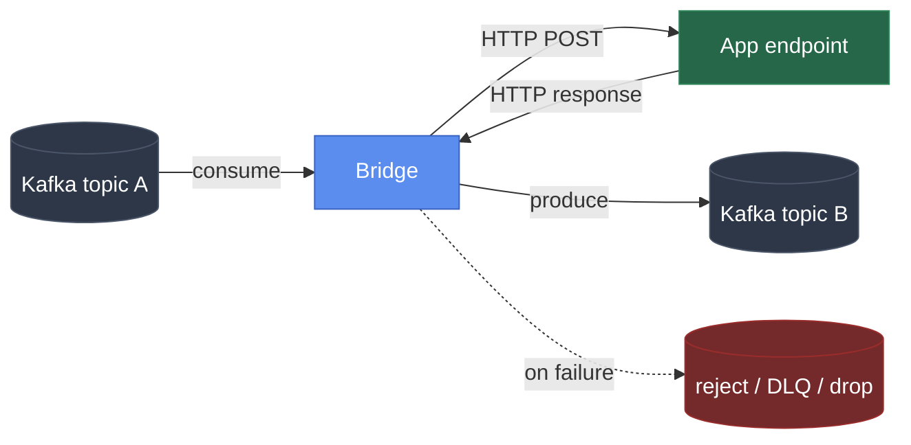
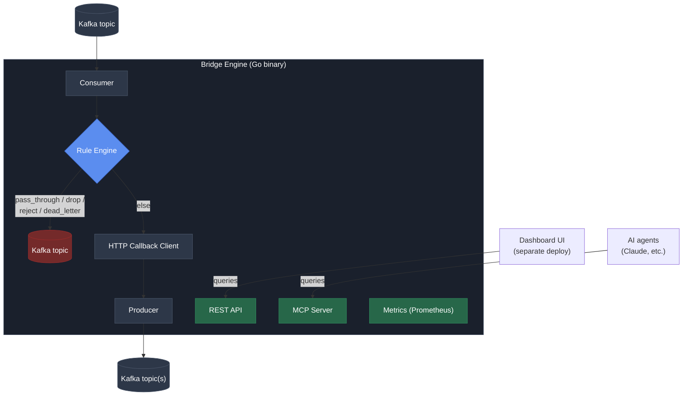

# Kafka Callback Bridge: Project Plan

> Config-driven middleware that connects Kafka topics to plain HTTP apps
> (consume, validate/route, callback, produce), with an MCP interface
> so AI agents can operate it, deployed as an open-source, self-hosted tool.

Owner: ekdanai.kk@gmail.com
License: Apache License 2.0
Status: Phase 1 and 2 done. Phase 4 (`workers: N`) and Phase 5
(status/pause/resume/metrics) partially done, see checkboxes below.

---

## 1. Problem statement

Teams that already have working apps (any language) want to plug into
Kafka without every team writing its own Kafka consumer/producer code,
handling retries, dead-lettering, offset commits, and rebalances by hand.

**The Bridge** sits between Kafka and an app's existing HTTP endpoint:



The app never touches a Kafka client library. It just implements one
HTTP endpoint it already knows how to build.

Kafka topic A on the left is also the Bridge's queue, the same role
NiFi's inter-processor connections play. Pausing or stopping a
pipeline doesn't drop anything: messages just sit in that topic,
bounded by its retention setting, until consumption resumes. Since the
queue lives in Kafka rather than on any Bridge instance's own disk, a
Bridge node crashing mid-message doesn't touch it either. The offset
for that message was never committed (commit only happens after a
successful produce), so it's simply redelivered to whichever Bridge
node picks up that partition next.

## 2. Non-goals (v1)

- Not a general-purpose iPaaS, not competing with n8n, Camel, or
  Zapier on breadth. Scope stays Kafka-native and HTTP-callback-shaped.
- Not a hosted/managed service. Self-hosted, single binary or Docker
  image, operator controls their own uptime.
- Not a new storage/database engine. Uses Kafka itself as the buffer,
  no custom persistence layer in v1.

## 3. Differentiation (why build this vs. existing tools)

| Existing tool | Gap it leaves |
|---|---|
| Kafka Connect | Powerful but heavy. Needs a Connect cluster, JVM, custom connector code for anything off the beaten path. |
| Strimzi/AMQ HTTP Bridge | Protocol translator (HTTP↔Kafka RPC-style), not an orchestrator. Each instance pins consumer state in memory and doesn't scale horizontally well for this pattern. |
| n8n / Camel / Benthos | General-purpose, hundreds of connectors, heavier to deploy and reason about for a single narrow pattern. |

**Our bet:** be the smallest, most opinionated tool that does exactly
"consume, validate/route, callback, produce," with built-in
correlation IDs, retry, dead-lettering, and sticky-partition ordering.
Config in YAML, one binary, minutes to deploy. And give AI agents a
native way to operate it (MCP), which none of the above do today.

## 4. Architecture overview



Two additional interfaces sit alongside the REST API, both reading
from the same internal state (pipeline registry, metrics, DLQ store).
They're thin adapters, not separate sources of truth.

- **REST API**: for the Dashboard UI (separate deployable service).
- **MCP Server**: for AI agents (Claude Desktop, Claude Code, or any
  MCP-capable client) to inspect and operate the Bridge conversationally.

## 5. Core concepts / config schema

```yaml
pipelines:
  - name: order-processor
    tenant: team-a                      # for multi-team isolation/metrics
    mcp_access: read_write              # read_only | read_write | none (default: read_only)
    source_topic: orders.raw
    destination_topic: orders.processed
    dead_letter_topic: orders.dlq
    reject_topic: orders.rejected

    consumer_group: order-processor-group
    workers: 3                          # consumer-group members (goroutines) in this process
    consumer:
      max_poll_records: 50
      max_poll_interval_ms: 300000

    target:
      mode: single_url                  # or multi_url
      url: http://order-app:8080/process
      health_check_url: http://order-app:8080/health   # optional
      health_check_interval_seconds: 10                 # default when health_check_url is set
      # mode: multi_url
      # urls: [http://worker-1:8080/process, ...]
      # strategy: sticky_partition       # or round_robin, least_inflight

    concurrency:
      max_in_flight: 10

    retry:
      max_attempts: 3
      backoff_ms: 1000

    fast_path_rules:                    # evaluated before any HTTP callback
      - name: auto-approve-small-orders
        condition: "data.amount < 1000 && data.risk_score < 0.3"
        action: pass_through
      - name: invalid-missing-field
        condition: "data.customer_id == nil"
        action: reject
      - name: drop-test-data
        condition: "data.env == 'test'"
        action: drop
      - name: suspicious-fraud-flag
        condition: "data.risk_score > 0.9"
        action: dead_letter
```

Rule actions: `pass_through`, `reject`, `drop`, `dead_letter`. Anything
not matched by a rule falls through to the normal callback flow.

**Chaining pipelines.** There's no special "multi-stage pipeline"
feature, and none is needed for the common case of wanting several
processing stages. A `destination_topic` of one pipeline can simply be
the `source_topic` of another: `orders.raw` to pipeline A to
`orders.staged` to pipeline B to `orders.processed`. Each stage is an
ordinary entry in `pipelines:`, independently pausable/resumable and
independently observable in metrics. This covers "long, multi-step
pipelines" without any engine changes. See §6's Phase 3 extensions for
`post_callback_rules`, which covers the other half: smarter branching
*within* one stage, still without becoming a general DAG engine (see
§11 for why).

## 6. Phased roadmap

### Backend: Phase 1: Core engine (MVP), done
- [x] Go module scaffold (`cmd/bridge`, `internal/...`)
- [x] Config loader (YAML to typed struct, validation)
- [x] Kafka consumer wrapper (single pipeline, single partition strategy)
- [x] HTTP callback client with correlation ID injection
- [x] Kafka producer wrapper (destination topic)
- [x] At-least-once semantics (commit offset only after produce succeeds)
- [x] Structured JSON logging with correlation ID
- **Exit criteria:** one pipeline, one topic in, one topic out, via HTTP
  callback, running locally against docker-compose Kafka. Verified end
  to end against live docker-compose Kafka.

### Backend: Phase 2: Reliability, done
- [x] Retry with backoff on callback failure/timeout
- [x] Retry with backoff on produce failure too (destination/DLQ/reject
      topics), not just the HTTP callback. Found by testing: a
      transient produce error was failing a message permanently for
      the running process instead of being retried.
- [x] Dead-letter topic on exhausted retries, but only for a
      message-specific failure (the destination is otherwise healthy
      and responding, this particular message's attempts all failed).
      When the circuit breaker is open, that's a destination-wide
      outage, not a bad message, so `process()` blocks in place
      re-checking the breaker instead of giving up. Nothing goes to
      DLQ during an outage; the message just sits in `source_topic`
      (already the queue, see §1) until the destination is reachable
      again.
- [x] Reject action (4xx callback response, non-retryable) routes to `reject_topic`
- [x] Concurrency limiter (max_in_flight) with in-order offset commit
- [x] Consumer pause/resume (`POST /api/v1/pipelines/{name}/pause|resume`,
      moved up from Phase 5 since it only needed the engine, not the
      full REST API)
- [x] Circuit breaker around the callback client
- [x] Optional `target.health_check_url`. While the breaker is open, a
      background probe periodically checks it and closes the breaker
      on success, so recovery doesn't depend on new traffic arriving
      to trigger a retry. Doubles as a way to wake a cold/sleeping
      destination using whatever health endpoint it already exposes.
- **Exit criteria:** a flaky/slow downstream app no longer causes
  message loss or unbounded queueing; DLQ and reject topics populate
  correctly. Verified: retries exhaust against a message-specific
  failure and DLQ populates; a destination-wide outage opens the
  breaker, messages block in place with zero commits,
  `target.health_check_url` closes the breaker without new traffic,
  and the whole backlog is genuinely retried (not skipped) once the
  destination is reachable again. A real bug was found and fixed
  here: an earlier version let a later message on the same partition
  commit past an unresolved earlier one, since Kafka's offset commit
  is a single resume pointer, not a per-message ledger. Skipping any
  offset at all silently drops it.

### Backend: Phase 3: Rule engine (fast path), done
- [x] Expression evaluator (`expr-lang/expr`) wired to rule config.
      Conditions use `expr`'s own syntax, not JSON/JS: null checks are
      `data.field == nil`, not `== null` (`null` fails to compile).
      A message whose value isn't valid JSON simply matches no rule
      and falls through to the normal callback flow rather than erroring.
- [x] `pass_through` / `drop` / `reject` / `dead_letter` actions, plus
      `transform_route` (either `destination_override` to a different
      Kafka topic, or `webhook_override` to a different HTTP endpoint,
      not both)
- [x] Rule ordering (first match wins) and per-rule metrics
      (`ark_fast_path_rule_matches_total`,
      `ark_post_callback_rule_matches_total`, labeled by rule and action)
- [x] `post_callback_rules` implemented alongside `fast_path_rules`
      using the same evaluator, evaluated on `{data, response: {status,
      body}}` after a successful (2xx) callback instead of on the raw
      incoming message
- **Exit criteria:** messages matching a rule skip the HTTP callback
  entirely; metrics show the split between fast-path and callback
  traffic. Verified end to end against a live stack: `pass_through`,
  `reject`, `drop`, and `dead_letter` all confirmed via fast_path_rules
  on real messages, and `transform_route` confirmed via
  post_callback_rules for both `destination_override` (routed to a
  topic that didn't exist yet, auto-created, retried, delivered) and
  `webhook_override` (routed to a second HTTP endpoint).

#### Phase 3 extensions (post-v1, staged by real need)

`fast_path_rules` started with exactly the 4 actions above and
`transform_route` shipped alongside them since it reused the same
evaluator and was needed by `post_callback_rules` anyway. The
extensions below (schema validation, payload transforms, dedup, rate
limiting) are real and useful, and each adds real complexity, so
they're staged rather than built all at once.

- **v1 (Phase 3 itself, done):** `pass_through` / `reject` / `drop` /
  `dead_letter` / `transform_route`. Covers most routing needs.
- **v1.5, schema validation as a first-class action:**
  ```yaml
  - name: schema-check
    action: reject
    unless_schema_valid: "./schemas/order.schema.json"
  ```
  Replaces hand-written null-check conditions with a JSON Schema
  reference. Highest value-to-complexity ratio of this whole list,
  the next thing to build after v1.
- **v2, transform, per-destination routing override, dedup, rate
  limit:**
  - `transform_pass_through`: redact/add fields on the fast path
    without a callback round-trip (for example, strip `ssn` and
    `credit_card`, stamp `processed_by` and `ts`). Useful for PII
    redaction or metadata tagging before forwarding.
  - `destination_override` on a rule: send a match to a topic other
    than the pipeline's default `destination_topic` (route by region,
    for example), or `webhook_override` to call a different HTTP
    endpoint instead of a topic (same either/or choice
    `post_callback_rules` has, see below). Fan-out to multiple
    destinations from one rule ties into the Phase 7 fan-out sink work.
  - `sample_rate` on a rule: let only a configured fraction of matches
    through (keep 10% of debug-tier events, for example).
  - Per-rule rate limiting: matches beyond a threshold per second get
    dropped or dead-lettered instead of passing. Guards against a bug
    that suddenly floods a rule.
  - Time-based conditions (`time.hour`, `time.weekday`) for
    business-hours-only routing.
  - A rule-level safety valve: auto-disable (and alert, not just log)
    a rule whose match rate suddenly spikes far outside its historical
    norm, so a bad rule can't silently bypass every callback.
- **v2.5+, stateful conditions and enrichment lookups:** the two most
  complex items, both needing a state store (in-memory with TTL, or an
  embedded KV) that v1 deliberately has none of.
  - Deduplication (drop a repeated key within N seconds) and windowed
    thresholds ("same customer errors 5 times in 1 minute, then
    dead_letter") both require memory across messages, not just a
    single message's fields.
  - Enrichment lookups (check `customer_id` against a blocklist, for
    example) before a rule decision must stay local-cache-only. A rule
    that calls out to a network service on every message defeats the
    point of a "fast path."

**`post_callback_rules` is the mirror-image feature, evaluated on the
callback's *response* instead of the incoming message:**

```yaml
post_callback_rules:
  - name: high-value-order-alert
    condition: "response.status == 200 && response.body.amount > 10000"
    action: transform_route
    destination_override: orders.high-value        # send to a different Kafka topic
  - name: notify-fraud-team
    condition: "response.body.risk_score > 0.9"
    action: transform_route
    webhook_override: http://fraud-alerts.internal/notify  # OR call a different HTTP API
  - name: callback-said-retry
    condition: "response.body.retry_after != nil"
    action: dead_letter
```

Answers "the callback came back, now what: check if it actually
succeeded by app-level standards (not just HTTP status), transform the
result, decide where it goes." Still exactly one callback per message,
just richer post-processing of its result. This is the bounded way to
get that behavior without turning the engine into a general DAG/flow
graph (see §11 for the explicit scope decision behind this). Implemented
in Phase 3 alongside `fast_path_rules`, since it's the same
rule-evaluation machinery pointed at a different input (`{data,
response: {status, body}}` instead of just the raw message).

**A rule's destination isn't limited to "another Kafka topic."**
`destination_override` (produce to a topic) and `webhook_override`
(POST to a different HTTP endpoint than the pipeline's own
`target.url`) are both valid on the same action. A rule picks exactly
one of the two per match. This is what makes "send this to that other
API, or into Kafka, depending on the rule" expressible without a
special case: routing was always going to a "sink," and a sink is
either a topic or a webhook. Needing **both** at once from one match
(fan out to a topic *and* a webhook *and* a DB) is the separate,
larger Phase 7 fan-out feature. One rule choosing between two single
destinations is v2-scope; fan-out to multiple simultaneous
destinations is Phase 7-scope, staged later since it needs its own
delivery/partial-failure semantics (what happens if the topic produce
succeeds but the webhook call fails?).

### Backend: Phase 4: Multi-pipeline and multi-tenant
- [x] Multiple pipelines in one config, isolated goroutine pools
- [x] Per-pipeline `workers` count: N consumer-group members
      (goroutines) in one process. Kafka's own group coordinator
      splits the source topic's partitions across them, so no extra
      deploys are needed to use more than one core for a single
      pipeline.
- [ ] Tenant label on every metric/log line
- [ ] Hot-reload config without downtime (file watch or reload endpoint)
- [ ] `multi_url` target mode: round-robin, least-in-flight, sticky-partition
- [ ] Health-checked worker pool for multi_url targets
- **Exit criteria:** two independent teams' pipelines run in one Bridge
  process without interfering with each other's throughput or config.

#### Phase 4b: ARK Cluster (multi-node, opt-in)

`workers: N` above parallelizes a pipeline across goroutines *within
one process*. It does nothing if one machine's capacity is the actual
ceiling. ARK Cluster is the answer to that case: spreading a
pipeline's workers across multiple ARK processes/machines, with
automatic placement and failover if a node dies. It's entirely
opt-in. A single `docker compose up` with no cluster config stays a
single-node deployment, exactly as built through Phase 4. Whether to
run one node or a cluster is the operator's call, not something the
Bridge forces.

The design deliberately reuses Kafka itself as the coordination
backbone instead of embedding a Raft/gossip implementation or taking a
dependency on an external coordinator like etcd, ZooKeeper, or k8s.

1. **Heartbeat.** Every ARK node produces periodically to an internal
   topic (`__ark_cluster_nodes`), reporting that it's alive and its
   current capacity.
2. **Leader election.** Every node tries to consume a single-partition
   internal topic (`__ark_leader_election`) under one consumer group.
   Kafka only ever hands that one partition to one group member at a
   time, so whichever node holds it is the leader. If that node dies,
   Kafka's own rebalance immediately hands the partition to a
   survivor, which becomes the new leader. No separate election
   protocol to write.
3. **Placement.** The leader reads current heartbeats, decides which
   node should run which pipeline's worker slots, and writes that
   decision to another internal topic (`__ark_placements`).
4. **Execution.** Every node consumes `__ark_placements`. A node spins
   up the worker slots it's been assigned and ignores the rest.
5. **Failure.** A node's heartbeat goes stale, the leader notices and
   reassigns its slots to the remaining nodes via a new placement
   record. On restart, a node just rejoins and waits for its next
   assignment.

Net effect: scaling `order-processor` to 3 workers via MCP/UI is one
call regardless of node count. The cluster decides *where* those 3
workers run, and adding a new ARK process (any host, any way it's
launched) makes it join and pick up a share of the work automatically,
with no orchestration script involved. All coordination state
(heartbeats, placements) lives in ordinary replicated Kafka topics,
consistent with §2's non-goal of not building a new storage engine.
"Distributed state" here means Kafka's own replication, not a new DB.

This is real distributed-systems work (failure detection timing,
split-brain edges during a leader handoff, placement rebalancing
policy) and is staged after Phase 4's single-node multi-pipeline
support is solid. Build it when a real deployment actually needs more
than one node's capacity, not speculatively.

**Config distribution.** Today every node reads `pipelines:` from its
own local YAML file, which is fine for one node but wrong for a
cluster: node A and B can silently disagree if only one file gets
edited. Fix: pipeline config becomes a compacted Kafka topic
(`__ark_pipeline_config`, key equals pipeline name) that every node
consumes to build its in-memory config. The local YAML file becomes
just the bootstrap seed for an empty topic, not the ongoing source of
truth. This gets replication/durability for free from Kafka's own
topic replication (consistent with §2, still no new storage engine),
and it directly plugs into Phase 4's "hot-reload" item and Phase 6's
`apply_pipeline_config`/`create_pipeline`, which would write to this
topic instead of touching a file.

**What happens if Kafka itself is down, not just one ARK node.** Two
separate failure modes, two different answers.

- *Kafka fully unreachable while ARK is already running:* every ARK
  node loses coordination (heartbeat/leader-election/placement) and
  the data plane (consume/callback/produce) at the same time, since
  both depend on the same Kafka. This can't produce a split-brain,
  because no node believes it's "still working alone" while others
  are cut off. Nobody can do anything without Kafka regardless of
  cluster design. The moment Kafka comes back, coordination and
  processing both resume from where committed offsets/state left off.
  This is a direct consequence of putting coordination on the same
  substrate as the actual work, not a gap to fix.
- *A node restarts while Kafka is briefly unreachable:* this is the
  real gap. With config living only in the `__ark_pipeline_config`
  topic, a restarting node can't even boot. Fix: every node keeps a
  local on-disk snapshot of the last config it consumed, written on
  every update. On startup, it tries Kafka first; if unreachable, it
  boots from the local snapshot instead of failing, and resyncs once
  Kafka is reachable again. This is a per-node resilience cache, not a
  second source of truth. It holds no state that isn't also in Kafka.

**Why Kafka-coordinator-based leader election instead of a real Raft
quorum (embedded `hashicorp/raft`, or an external etcd/Consul):**

| | Kafka consumer-group coordinator (chosen) | Raft quorum (etcd/Consul/embedded) |
|---|---|---|
| Extra infra | None, reuses Kafka, which ARK already requires | A separate etcd/Consul cluster, or an embedded Raft log/snapshot implementation |
| Code size | Roughly 200 to 400 lines: heartbeat, consume a topic, react to rebalance | A full consensus implementation or another dependency to operate |
| Node count | Any N ≥ 1, no wasted nodes | Must stay odd for full fault tolerance (majority = ⌊N/2⌋+1, so N=2 tolerates zero failures) |
| Split-brain protection | Kafka's own rebalance `generation` ID fences stale members, same idea as Raft's term number | Purpose-built for this, more battle-tested at the edges |
| Failure-detection speed | Timeout-based (session timeout, roughly 10 to 45 seconds), tied to Kafka's settings | Also timeout-based, but tunable independently and typically faster |
| Operator familiarity | A repurposed mechanism, less standard mental model to debug against | Very standard ("3-node Raft, need 2 up"), widely recognized |
| Fits ARK's positioning (§3) | Yes, one binary, minutes to deploy | No, reintroduces the exact heavyweight-dependency problem §3 differentiates against |

**Decision:** Kafka-coordinator-based election. The thing being
decided ("which node runs which worker slot") isn't
strongly-consistent data where a brief inconsistency is dangerous.
At-least-once processing already tolerates a worker being briefly
absent during a handoff. A full Raft implementation would be solving a
harder problem than ARK actually has, at a cost (extra infra, more
code, odd-node-count constraint) that directly contradicts §3's
differentiation bet. Revisit only if the Kafka-coordinator approach
proves unreliable in practice, not preemptively.

### Backend: Phase 5: Observability, mostly done
- [x] Prometheus metrics endpoint: per-pipeline/worker throughput
      counters (processed/rejected/dead_lettered/failed/backpressured),
      callback latency histogram, consumer lag gauge (from kafka-go's
      `Reader.Stats().Lag`), circuit breaker state, pause state, worker
      liveness (`ark_worker_up`), last-activity timestamp (answers "is
      this pipeline actually flowing data right now" directly instead
      of inferring it from lag and throughput separately)
- [ ] Per-tenant metric breakdown (tenant label isn't wired into
      metrics yet, only into `Status`)
- [x] REST API: list pipelines (`GET /api/v1/pipelines`), pipeline
      detail (`GET /api/v1/pipelines/{name}`), pause/resume
      (`POST .../pause`, `POST .../resume`)
- [ ] View DLQ, retry/discard DLQ message
- **Exit criteria:** an operator can answer "is this healthy?" from
  metrics alone, and act on a stuck DLQ message via API. Metrics half
  done; DLQ browsing/retry still open.

### Backend: Phase 6: MCP server (AI-agent interface)

**Permission model, two layers, both enforced server-side (never trust
the calling agent to self-restrict):**

1. **Token-level scope.** The API token used to connect the MCP server
   carries one of:
   - `viewer`: every read tool works; every write tool returns a
     permission error, full stop, regardless of any pipeline's own
     `mcp_access` setting.
   - `operator`: read tools work everywhere; write tools work only on
     pipelines whose own `mcp_access` allows it (see below).
   - `admin`: read/write everywhere, including config tools
     (`apply_pipeline_config`).

   Tokens are issued and revocable independently of each other, so a
   token handed to an analysis-only agent can simply be `viewer` and
   nothing else needs configuring per pipeline.

2. **Per-pipeline `mcp_access`** (config field, shown above) narrows
   what an `operator`/`admin` token may do to *that specific pipeline*:
   - `read_only` (default): status/metrics/DLQ browsing only; any
     write tool call targeting this pipeline is rejected even for an
     `operator` or `admin` token. This is the setting for pipelines
     you want an analysis agent to see but never touch, a production
     billing pipeline that should only ever be read for reporting, for
     example.
   - `read_write`: write tools (pause/resume/retry/discard) are
     allowed if the token scope also allows them.
   - `none`: pipeline is invisible to MCP entirely (excluded from
     `list_pipelines` and all other tool results for that connection).

   Net effect: a pipeline's own `read_only` flag is a hard ceiling, no
   token scope can override it. Token scope is a floor/ceiling on the
   *agent*; pipeline `mcp_access` is a ceiling on the *pipeline*. Both
   must allow an action for it to execute.

- [ ] Stand up an MCP server process (can be embedded in the Bridge
      binary or a thin sidecar that calls the REST API, decide based
      on how Phase 5's API turns out)
- [ ] Define token scopes (`viewer` / `operator` / `admin`) and a token
      issuance/revocation mechanism (reuse REST API's auth store)
- [ ] Enforce per-pipeline `mcp_access` on every tool call server-side,
      before touching Kafka or the callback target
- [ ] Expose read tools (available to all scopes, filtered by each
      pipeline's `mcp_access != none`):
      `list_pipelines`, `get_pipeline_status`, `get_metrics`,
      `list_dlq_messages`, `get_dlq_message`
- [ ] Expose write tools (require `operator`/`admin` token AND pipeline
      `mcp_access: read_write`): `pause_pipeline`, `resume_pipeline`,
      `retry_dlq_message`, `discard_dlq_message`
- [ ] Expose config tools (require `admin` token only, gated behind
      explicit confirmation in the calling client):
      `validate_pipeline_config`, `apply_pipeline_config` (hot-reload)
- [ ] Audit log every write/config tool call (who, token id, pipeline,
      action, timestamp), separate from the general structured log, so
      "what did the AI agent change and when" is always answerable
- **Exit criteria:** an analysis-only agent connected with a `viewer`
  token (or an `operator` token on a `read_only`-flagged pipeline) can
  answer "what's the error rate on order-processor right now?" but a
  call to `pause_pipeline` from that same connection is rejected with
  a clear permission error. Verified with an automated test for each
  of the three token scopes times three `mcp_access` settings (9
  combinations).

### Backend: Phase 7: Extensibility
- [ ] `Source` and `Sink` interfaces (Kafka is one implementation of each)
- [ ] Database sink (direct insert/upsert, bypassing HTTP callback)
- [ ] Fan-out destinations (topic, webhook, and DB in one pipeline)
- [ ] **HTTP source** (webhook receiver), the mirror image of
      everything built so far. Today a pipeline's only direction is
      Kafka to ARK to outbound HTTP callback; this is inbound HTTP to
      ARK to Kafka instead. An external caller (Stripe, GitHub, an
      internal app that only knows how to POST, anything) hits an
      endpoint ARK exposes, and ARK produces that request body onto a
      topic. A pipeline using an HTTP source has no
      `source_topic`/`consumer_group` (nothing to consume, the trigger
      is the inbound request itself), but otherwise reuses the same
      `Sink`/retry/DLQ machinery the Kafka source already has for the
      produce side. Real, common use case (getting external webhooks
      into Kafka without a one-off receiver per integration), staged
      here because it needs its own design pass: auth on the inbound
      endpoint, request size limits, sync-vs-async response semantics
      (does the caller wait for the produce to confirm, or get a 202
      immediately?), rather than being a small addition to the
      existing Kafka-source path.
- [ ] Revisit: CDC source, RabbitMQ/NATS, schedule trigger, only if
      real demand shows up after Phase 1 through 6 are solid

### Frontend: Phase A: Read-only metrics (fastest path)
- [ ] Ensure Prometheus metrics are scrape-ready
- [ ] Ship a starter Grafana dashboard JSON (no custom UI code needed)
- **Exit criteria:** `docker-compose up` gives Bridge, Prometheus, and
  Grafana with a working dashboard out of the box.

### Frontend: Phase B: Dashboard UI (separate deployable service)
- [ ] Separate repo/binary (`bridge-ui`), own Docker image
- [ ] Calls Bridge REST API only (never touches Kafka directly)
- [ ] Views: pipeline list and status, pipeline detail and live
      metrics, DLQ browser with retry/discard actions
- [ ] Own auth/login, versioned API client (`/api/v1/...`)
- **Exit criteria:** an operator manages pipelines and DLQ entirely
  from the web UI, deployed and released independently from the engine.

### Frontend: Phase C: Visual rule builder (deferred)
- On hold. Only revisit if Phase A/B in production reveals real demand
  for editing rules without touching YAML, and even then, re-evaluate
  against adopting n8n instead of building a visual builder from scratch.

## 7. Tech stack

- Language: Go. The concurrency model fits consume/callback/produce
  well, it compiles to a single static binary, and there are strong
  Kafka client libraries (`franz-go` or `segmentio/kafka-go`).
- Expression engine: `expr-lang/expr`, chosen over `google/cel-go` for
  `fast_path_rules`/`post_callback_rules` conditions. Its syntax reads
  closer to the plain boolean expressions in this doc's examples.
- Metrics: Prometheus client library.
- MCP: official Go MCP SDK, or a thin JSON-RPC-over-stdio/HTTP shim if
  no mature Go SDK is available at implementation time (confirm during
  Phase 6).
- Dashboard UI: Go with HTMX, or a lightweight SPA. Decide at Phase B,
  not before, to avoid committing to a frontend framework early.

## 8. Repo layout (proposed)

```
kafka-bridge/
├── PLAN.md
├── bridge-engine/
│   ├── cmd/bridge/
│   ├── internal/
│   │   ├── config/
│   │   ├── consumer/
│   │   ├── producer/
│   │   ├── rules/
│   │   ├── callback/
│   │   ├── api/            # REST API (Phase 5)
│   │   └── mcp/             # MCP server (Phase 6)
│   ├── go.mod
│   └── Dockerfile
└── bridge-ui/               # separate deploy (Phase B)
    ├── cmd/
    ├── go.mod
    └── Dockerfile
```

## 9. Natural-language pipeline creation ("describe it, don't write YAML")

Goal: a person describes what they want in plain language ("ดึงจาก topic
orders.raw ส่งไป http://app:8080/process แล้วโยนไป orders.processed, ถ้า
amount ต่ำกว่า 1000 ให้ผ่านเลยไม่ต้องเรียก callback") and an AI agent
connected via MCP turns that into a valid pipeline config, shows it
back for confirmation, and applies it. No hand-written YAML required.

This does **not** need a new NLP component in the Bridge itself. The
Bridge stays a deterministic engine; the "understand what the person
wants" part is done by whichever AI agent is connected (Claude, etc.).
The Bridge's job is only to tell the agent the exact schema so it
doesn't hallucinate fields, and to validate and apply safely.

**Two creation modes, both calling the same `create_pipeline` tool,
just with a different completeness level:**

- **Full mode.** The person describes everything needed (source topic,
  target, what happens on error, etc.) in the conversation. The agent
  fills a complete, valid config and creates a pipeline that's
  immediately running after confirmation. Best when the person already
  knows the shape of what they want.

- **Draft mode.** The person gives only the part they know right now
  ("ทำ pipeline ชื่อ order-processor ดึงจาก orders.raw ก่อน ที่เหลือไปตั้ง
  ใน UI"), and the agent creates the pipeline in a **disabled/draft
  state**: only `name` and `source_topic` are required, every other
  field gets a safe placeholder (`target: null`, `destination_topic:
  null`, `enabled: false`). A pipeline with `enabled: false` is fully
  visible in the config store and the Dashboard UI, but the Consumer
  never starts for it, so nothing runs, nothing can callback into a
  URL that doesn't exist yet, nothing produces to a topic that was
  never specified. The person then opens the Dashboard UI, fills in
  the rest (target URL, rules, retry policy, etc.), and flips it to
  `enabled: true` there, which calls the same REST endpoint the UI
  always uses to update a pipeline, no MCP involved at that point.

This means `create_pipeline`'s only hard requirement is `name` and
`source_topic`. Everything else is optional at creation time, but the
pipeline stays `enabled: false` until the required-for-running fields
(`target`, `destination_topic`, or an explicit "no destination" flag)
are present. The engine itself refuses to flip a pipeline to
`enabled: true` if those are still missing, whether that flip is
attempted from MCP or the UI. This is the one validation rule that
matters most in practice: **it should be impossible to accidentally
activate a half-configured pipeline**, regardless of which interface
(chat or UI) did the "flip enabled" step.

**New tools needed for this (added to Phase 6):**

- `get_pipeline_schema` returns the current JSON Schema for a pipeline
  config (field names, types, enums for `action`/`strategy`/`mcp_access`,
  which fields are required vs optional, defaults). The agent fetches
  this once at the start of a creation conversation so its generated
  YAML/JSON is structurally valid before it ever calls `validate_*`.
- `list_topics` (read, requires a Kafka admin-client connection from
  the Bridge) lets the agent offer real topic names instead of
  guessing, and warn the person if a topic they named doesn't exist yet.
- `create_pipeline` (admin scope) accepts a full pipeline config object
  (not a YAML diff), runs the same validation as
  `validate_pipeline_config`, and if valid, writes it into the running
  config store and hot-reloads. Distinct from `apply_pipeline_config`
  (Phase 6) in that it's additive (new pipeline name must not already
  exist) rather than replacing an existing one.

**Conversation flow, what actually happens end to end:**

1. Person describes intent in natural language to their AI agent.
2. Agent calls `get_pipeline_schema` (plus `list_topics` if useful) so
   it knows the real shape and real topic names to work with.
3. Agent fills in whatever the person specified and asks the person
   directly for anything required but missing (for example, "you
   didn't say what happens if the callback times out, how many
   retries?") rather than inventing defaults for things that matter.
4. Agent calls `validate_pipeline_config` with the draft. This is a
   dry run; nothing is created yet.
5. Agent shows the resulting config (or a plain-language summary of
   it) back to the person for a yes/no before doing anything live.
6. Only on explicit confirmation does the agent call `create_pipeline`.
   This call requires an `admin`-scope token, same rule as
   `apply_pipeline_config`, and is audit-logged.
7. Bridge confirms creation; agent tells the person the pipeline name
   and where to watch it (dashboard link or `get_pipeline_status`).

**Why this is safe despite being "AI creates infra config":**
- Nothing is created without step 5's explicit confirmation. The
  agent is not authorized to skip straight from description to live
  pipeline.
- `create_pipeline` still runs full schema and semantic validation
  server-side (valid topic names, no duplicate pipeline name, sane
  numeric ranges). The agent's output is never trusted blindly.
- Requires an `admin` token, so this capability can be withheld from
  any MCP connection that should only ever read or only ever operate
  existing pipelines (see the scope table below).
- Every creation is audit-logged the same as any other write action.

**Where this lands in the roadmap:** implement right after Phase 6's
core read/write tools work, since it reuses the same auth and audit
plumbing. Treat it as **Phase 6b**, not a separate later phase.

## 10. MCP tool reference (target shape for Phase 6)

| Tool | Scope required | Pipeline `mcp_access` required | Notes |
|---|---|---|---|
| `list_pipelines` | any | (filters out `none`) | shows `mcp_access` value per pipeline in output so the agent knows what it can/can't do next |
| `get_pipeline_status` | any | `read_only` or `read_write` | throughput, lag, error rate |
| `get_metrics` | any | `read_only` or `read_write` | time-ranged metrics query |
| `list_dlq_messages` / `get_dlq_message` | any | `read_only` or `read_write` | read-only inspection |
| `pause_pipeline` / `resume_pipeline` | `operator`, `admin` | `read_write` | audit-logged |
| `retry_dlq_message` / `discard_dlq_message` | `operator`, `admin` | `read_write` | audit-logged |
| `validate_pipeline_config` | `admin` | n/a (validates a proposed config, doesn't touch a live one) | dry-run only |
| `apply_pipeline_config` | `admin` | n/a (acts on whichever pipeline the new config names) | audit-logged, requires explicit confirmation step in the client |

## 11. Open decisions to revisit

- Embed MCP server in the engine binary vs. a separate sidecar
  process. Decide once Phase 5's REST API shape is settled.
- Whether `reject` needs a synchronous response path back to an
  upstream caller, or is always fire-and-forget into `reject_topic`
  (current assumption: fire-and-forget/async).
- Single Git repo (monorepo, two binaries) vs. two repos. Leaning
  monorepo for now to share config/schema types.
- Manual partition pinning was requested (an operator choosing exactly
  which partition each worker reads, instead of Kafka's group
  coordinator deciding). Checked against kafka-go: `GroupID` and
  `Partition` are mutually exclusive on a Reader, so manual pinning
  means giving up group-committed offsets and persisting them
  ourselves, reintroducing the "new storage layer" §2 rules out, and
  losing the automatic-failover behavior `workers: N` already gets for
  free. Current recommendation: don't build it. `workers: N` plus
  Kafka's own assignor already distributes a topic's partitions across
  workers without that cost. Revisit only if a concrete need for
  guaranteed partition-to-worker pinning shows up that `workers: N`
  can't satisfy.
- A general NiFi/n8n-style DAG engine (arbitrary chained processors,
  transform then filter then enrich then callback, each independently
  start/stoppable, wired together in a UI) was raised and explicitly
  declined in favor of two bounded features that cover the same real
  use cases without the redesign: chaining separate `pipelines:`
  entries via intermediate topics (§5, already supported, no engine
  change needed) for multi-stage flows, and `post_callback_rules` (§6,
  Phase 3 extensions) for branching on a callback's result within one
  stage. A full DAG engine would directly contradict §2/§3's
  positioning against n8n/NiFi/Camel and is a multi-week redesign, not
  a config addition. Revisit only if a real deployment hits a case
  neither bounded feature can express, and treat that as a deliberate
  positioning change requiring its own decision, not an incremental add.
