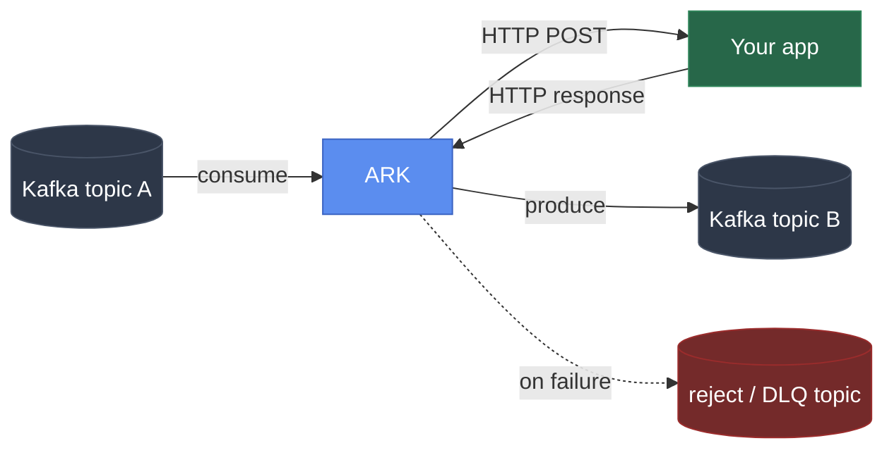

# ARK

**Connect any Kafka topic to any HTTP app, without writing a Kafka
client.** ARK sits between Kafka and your app's existing endpoint. It
consumes, calls your app, and produces the result, with retries, dead
lettering, a circuit breaker, and horizontal scaling built in. One Go
binary, minutes to deploy.



## Why

Teams that already have a working app want to plug it into Kafka
without every team writing its own consumer/producer code and handling
retries, dead lettering, offset commits, and rebalances by hand. With
ARK, your app just implements one HTTP endpoint it already knows how
to build, and ARK does the rest.

**The bet:** be the smallest, most opinionated tool that does exactly
"consume, validate or route, call back, produce," rather than a
general-purpose orchestrator like Kafka Connect, NiFi, n8n, or Camel
that needs a cluster of its own just to move messages between a topic
and an endpoint. The full reasoning and comparison live in
[PLAN.md](PLAN.md).

## What works today

Everything below is implemented and verified against a live
docker-compose Kafka, not just designed on paper.

```yaml
pipelines:
  - name: order-processor
    source_topic: orders.raw
    destination_topic: orders.processed
    dead_letter_topic: orders.dlq
    reject_topic: orders.rejected
    consumer_group: order-processor-group
    workers: 3                     # 3 consumer-group members in one process

    target:
      url: http://order-app:8080/process
      health_check_url: http://order-app:8080/
      health_check_interval_seconds: 5

    retry:
      max_attempts: 3
      backoff_ms: 1000
```

That's the whole config for a working pipeline. With it:

- **Nothing is lost on a crash.** Offsets only commit after a
  successful produce, so killing the process mid-message just means
  the next worker to pick up that partition redelivers it.
- **A callback that returns 4xx** (the message itself is the problem,
  not the app) routes to `reject_topic` with no retry.
- **Retries that fail past `max_attempts`** (5xx, timeout, a network
  error) don't flood `dead_letter_topic` forever once the destination
  is genuinely down. The circuit breaker opens, ARK stops hammering
  your app, and the message just blocks in place instead of getting
  dead-lettered. It's still sitting in `orders.raw`, right where it
  was, waiting.
- **Your app coming back is all it takes to unstick things.** Set
  `health_check_url` and ARK probes it while the breaker is open,
  closing the breaker the moment it responds. No need to wait for new
  traffic to trigger a retry. This was tested directly: 3 messages
  queued up behind a dead endpoint, nothing lost, and all three were
  genuinely retried and delivered the moment the app came back.
- **`workers: 3`** means Kafka's own consumer-group protocol splits
  `orders.raw`'s partitions across 3 goroutines in this one process.
  Scale a single pipeline up without deploying anything new.
- **Pause it without killing the process:**
  `POST /api/v1/pipelines/order-processor/pause` (and `/resume`).
- **See it live.** `GET /metrics` (Prometheus) exposes throughput,
  callback latency, consumer lag, circuit breaker state, worker
  liveness, and a last-activity timestamp per pipeline and worker, so
  "is this actually flowing data right now" has a direct answer
  instead of something you have to infer.

## Where it's going

Designed in detail in [PLAN.md](PLAN.md), not built yet:

- **Rule engine.** `fast_path_rules` skip the callback entirely for
  messages that match a condition (`pass_through`, `reject`, `drop`,
  `dead_letter`), and `post_callback_rules` branch on the callback's
  *response* instead: check whether it actually succeeded by
  app-level standards, transform the result, route it to a different
  topic, all without a second callback.
- **MCP server.** Point Claude, or any MCP client, at a running ARK
  and ask it what the error rate on order-processor is right now, have
  it pause a stuck pipeline, or describe a new pipeline in plain
  language and let the agent draft it, validate it, and (once you
  confirm) create it. Scoped by token (`viewer`, `operator`, `admin`)
  and per-pipeline `mcp_access`, so a read-only analysis agent can
  never accidentally touch production.
- **ARK Cluster.** Run several ARK processes across machines and let
  them split a pipeline's workers automatically, with failover if one
  dies. No etcd, no separate Raft cluster to operate: it reuses
  Kafka's own consumer-group coordination as the election and
  placement mechanism, since ARK already depends on Kafka being up
  anyway.
- **Dashboard UI.** A separate deployable service that talks to ARK's
  REST API: pipeline list, live metrics, a DLQ browser, all without
  touching Kafka directly.

## Repo layout

- `bridge-engine/` is the Go engine (consumer, rule engine, callback
  client, producer, REST API, MCP server).
- `bridge-ui/` is the dashboard UI, deployed separately from the
  engine.

## Running locally

```
docker compose up
```

This starts a single-node Kafka broker and the bridge engine wired to
`bridge-engine/config.example.yaml`. Kafka's own data directory is a
named volume by default. Point it at another disk or mount with:

```
KAFKA_DATA_DIR=/mnt/other-disk/kafka docker compose up
```

To run the engine directly:

```
cd bridge-engine
go run ./cmd/bridge -config config.example.yaml
```

## API

- `GET /healthz`: liveness
- `GET /metrics`: Prometheus metrics
- `GET /api/v1/pipelines`: status for every pipeline worker
- `GET /api/v1/pipelines/{name}`: status for one pipeline's workers
- `POST /api/v1/pipelines/{name}/pause` and `/resume`

## Contributing

PRs welcome. See [CONTRIBUTING.md](CONTRIBUTING.md) for dev setup,
what a good PR looks like, and where ARK's scope is deliberately
bounded (worth reading before proposing something big).

## License

Apache License 2.0. See [LICENSE](LICENSE).
