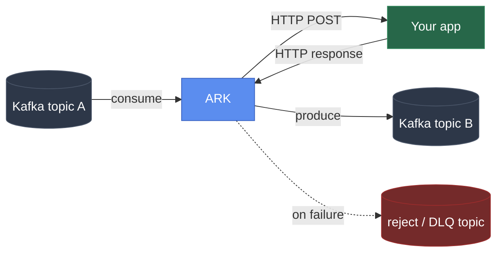

# ARK

**Connect any Kafka topic to any HTTP app, without writing a Kafka
client.** ARK sits between Kafka and your app's existing endpoint. It
consumes, calls your app, and produces the result, with retries, dead
lettering, a circuit breaker, and horizontal scaling built in. One Go
binary, minutes to deploy.



## Why

Teams that already have a working app want to plug it into Kafka
without every team writing its own consumer/producer code and handling
retries, dead lettering, offset commits, and rebalances by hand. With
ARK, your app just implements one HTTP endpoint it already knows how
to build, and ARK does the rest.

**The bet:** be the smallest, most opinionated tool that does exactly
"consume, validate or route, call back, produce," rather than a
general-purpose orchestrator like Kafka Connect, NiFi, n8n, or Camel
that needs a cluster of its own just to move messages between a topic
and an endpoint. The full reasoning and comparison live in
[PLAN.md](PLAN.md).

## What works today

Everything below is implemented and verified against a live
docker-compose Kafka, not just designed on paper.

```yaml
pipelines:
  - name: order-processor
    source_topic: orders.raw
    destination_topic: orders.processed
    dead_letter_topic: orders.dlq
    reject_topic: orders.rejected
    consumer_group: order-processor-group
    workers: 3                     # 3 consumer-group members in one process

    target:
      url: http://order-app:8080/process
      health_check_url: http://order-app:8080/
      health_check_interval_seconds: 5

    retry:
      max_attempts: 3
      backoff_ms: 1000
```

That's the whole config for a working pipeline. With it:

- **Nothing is lost on a crash or a failure.** Offsets only commit
  after a successful produce, so killing the process mid-message just
  means the next worker to pick up that partition redelivers it. A
  message that can't be completed is retried in place, and nothing after
  it on its partition is committed until it is. That's why
  `dead_letter_topic` is required: a message always ends up somewhere
  you can see it, never skipped. (`on_exhausted: block` opts out and
  keeps retrying instead.)
- **Every message carries a stable `X-Correlation-ID`,** derived from its
  topic, partition and offset, so a retry or a redelivery after a crash
  reaches your app with the same ID. Use it as an idempotency key:
  delivery is at-least-once, and this is how your app spots a repeat.
- **Order per key is kept** (`ordering: per_key`, the default): messages
  with the same key reach your app one at a time and in order, while
  different keys run in parallel. `per_partition` and `none` are also
  available.
- **A callback that returns 4xx** (the message itself is the problem,
  not the app) routes to `reject_topic` with no retry, or to the DLQ if
  there is no `reject_topic`. 408, 425 and 429 are the exception: they
  mean "come back later", so ARK waits (honoring `Retry-After`) and
  tries again without spending a retry. `target.reject_statuses`
  overrides which codes count as rejects.
- **Retries that fail past `max_attempts`** (5xx, timeout, a network
  error) don't flood `dead_letter_topic` forever once the destination
  is genuinely down. The circuit breaker opens, ARK stops hammering
  your app, and the message just blocks in place instead of getting
  dead-lettered. It's still sitting in `orders.raw`, right where it
  was, waiting.
- **Your app coming back is all it takes to unstick things.** Set
  `health_check_url` and ARK probes it while the breaker is open,
  closing the breaker the moment it responds. No need to wait for new
  traffic to trigger a retry. This was tested directly: 3 messages
  queued up behind a dead endpoint, nothing lost, and all three were
  genuinely retried and delivered the moment the app came back.
- **`workers: 3`** means Kafka's own consumer-group protocol splits
  `orders.raw`'s partitions across 3 goroutines in this one process.
  Scale a single pipeline up without deploying anything new.
- **Pause it without killing the process:**
  `POST /api/v1/pipelines/order-processor/pause` (and `/resume`). A
  pause holds across config reloads and restarts of the pipeline.
- **See it live.** `GET /metrics` (Prometheus) exposes throughput,
  callback latency, consumer lag, circuit breaker state, worker
  liveness, and a last-activity timestamp per pipeline and worker, so
  "is this actually flowing data right now" has a direct answer
  instead of something you have to infer.
- **`fast_path_rules` skip the callback entirely** for messages that
  match a condition, before ARK ever calls your app:

  ```yaml
  fast_path_rules:
    - name: auto-approve-small-orders
      condition: "data.amount < 1000 && data.risk_score < 0.3"
      action: pass_through
    - name: suspicious-fraud-flag
      condition: "data.risk_score > 0.9"
      action: dead_letter
  ```

  `pass_through`, `reject`, `drop`, and `dead_letter` all route
  without a callback round trip. Conditions use
  [`expr-lang/expr`](https://expr-lang.org) syntax (`nil`, not `null`).
- **`post_callback_rules` branch on the callback's response instead,**
  after it comes back: check whether it actually succeeded by
  app-level standards (not just HTTP status), and route the result to
  a different Kafka topic or a different HTTP endpoint entirely,
  without a second callback:

  ```yaml
  post_callback_rules:
    - name: high-value-order-alert
      condition: "response.status == 200 && response.body.amount > 10000"
      action: transform_route
      destination_override: orders.high-value   # or webhook_override: http://...
  ```

- **Browse, retry, or discard what landed in `dead_letter_topic` or
  `reject_topic`,** without a separate Kafka console tool:
  `GET /api/v1/pipelines/order-processor/dlq` lists recent entries,
  `POST .../dlq/{id}/retry` re-enters the message into the pipeline
  from `source_topic` (fast_path_rules and all), `POST .../dlq/{id}/discard`
  removes it from the list. Same routes under `.../reject`. What was
  retried or discarded is recorded in Kafka, so it stays handled after a
  restart and can't be retried twice. `dead_letter_redrive:
  {after_seconds: 3600, max_times: 3}` retries dead letters on a
  schedule and stops after `max_times`, leaving the rest for a human.
- **Spread a pipeline's callbacks across more than one backend
  instance** with `target.mode: multi_url`:

  ```yaml
  target:
    mode: multi_url
    urls:
      - http://order-app-1:8080/process
      - http://order-app-2:8080/process
    health_check_urls:
      - http://order-app-1:8080/
      - http://order-app-2:8080/
    health_check_interval_seconds: 5
    strategy: round_robin   # or least_inflight, sticky_partition
  ```

  Each URL is probed independently on `health_check_urls`; a message
  only ever goes to a healthy one, and if every URL is down the
  message blocks in place instead of getting dead-lettered, the same
  way a single_url pipeline behaves when its circuit breaker is open.
  `sticky_partition` keeps a given Kafka partition landing on the same
  backend for as long as that backend stays healthy, useful when the
  backend keeps per-partition local state.
- **Point Claude, or any MCP client, at a running ARK.** Set
  `ARK_MCP_VIEWER_TOKENS` / `ARK_MCP_OPERATOR_TOKENS` /
  `ARK_MCP_ADMIN_TOKENS` and ARK mounts a real MCP server at `/mcp` on
  the same port as the REST API, calling the same internal registry
  the REST handlers use rather than a separate reimplementation. A
  `viewer` token can ask what the error rate on order-processor is
  right now or list what landed in the DLQ; `operator` and `admin`
  tokens can also pause, resume, retry a DLQ entry, or discard one.
  Every pipeline also carries its own `mcp_access`
  (`read_only` / `read_write` / `none`), so a token's scope is a
  ceiling, not a grant: an `operator` token still can't write to a
  pipeline whose `mcp_access` is `read_only`. Every write call is
  audit-logged with the scope, action, pipeline, and entry, never the
  token itself. Verified against a scripted MCP client covering all
  three scopes, and separately against two different local models
  (`qwen2.5:7b`, `qwen3:8b` via Ollama) driving the server from plain
  English with no hardcoded tool-call logic, to check the tool
  descriptions actually explain themselves rather than only making
  sense to one model.

## Running more than one ARK

To add capacity, you don't need anything special: run more copies with
the same `consumer_group` and Kafka splits the partitions between them.

Turn on cluster mode when you want the copies to act as one ARK:

```yaml
cluster:
  enabled: true
  name: prod            # namespaces ARK's internal topics
  labels: {zone: dmz}   # optional, used by node_selector below
```

- **One config.** Pipeline config lives in a compacted Kafka topic. The
  first node seeds it from its file; after that, a reload on any node
  publishes to every node, and an invalid config is refused before it
  spreads. `GET /api/v1/cluster` shows which config version each node
  runs.
- **One control surface.** Pause through any node and the pipeline
  pauses everywhere, including on nodes that start it later.
  `GET /api/v1/cluster/pipelines` returns cluster-wide numbers with a
  per-node breakdown, and every node can browse, retry and discard any
  pipeline's DLQ.
- **Placement.** An elected leader spreads each pipeline's `workers`
  across live nodes, never more than the source topic has partitions,
  and only onto nodes matching the pipeline's
  `placement.node_selector` (for a target only reachable from one
  network zone, or to keep tenants apart). Membership changes add or
  remove workers in place instead of restarting pipelines.
- **Failover.** A node that stops cleanly hands its work over in about
  a second; one that crashes is replaced after `node_timeout_seconds`.
  Scheduled DLQ redrive runs on the leader only.

There's no etcd or Raft cluster to operate: coordination reuses Kafka's
own consumer-group protocol and compacted topics. See PLAN.md, Phase 4b
and 4c, for the design and what was verified.

## Where it's going

Designed in detail in [PLAN.md](PLAN.md), not built yet:

- **MCP config tools.** `validate_pipeline_config`,
  `apply_pipeline_config`, `create_pipeline`, `get_pipeline_schema`,
  and `list_topics`, so an agent can draft a new pipeline from a plain
  language description and, once you confirm, apply it (through the
  cluster config topic in cluster mode).
- **Dashboard UI.** A separate deployable service that talks to ARK's
  REST API: pipeline list, live metrics, a DLQ browser, all without
  touching Kafka directly.

## Repo layout

- `bridge-engine/` is the Go engine (consumer, rule engine, callback
  client, producer, REST API, MCP server).
- `bridge-ui/` is the dashboard UI, deployed separately from the
  engine.

## Running locally

```
docker compose up
```

This starts a single-node Kafka broker and the bridge engine wired to
`bridge-engine/config.example.yaml`. Kafka's own data directory is a
named volume by default. Point it at another disk or mount with:

```
KAFKA_DATA_DIR=/mnt/other-disk/kafka docker compose up
```

To run the engine directly:

```
cd bridge-engine
go run ./cmd/bridge -config config.example.yaml
```

## API

Every route except `/healthz` and `/metrics` needs a bearer token. Set
`ARK_API_VIEWER_TOKENS` (GET), `ARK_API_OPERATOR_TOKENS` (pause, resume,
DLQ retry and discard) and `ARK_API_ADMIN_TOKENS` (config reload), each a
comma-separated list. With none set, the API only answers requests from
localhost. These are separate from the `ARK_MCP_*` tokens, so a token
given to an agent for MCP can't be used against REST to get around
`mcp_access`.

- `GET /healthz`: liveness
- `GET /metrics`: Prometheus metrics
- `GET /api/v1/pipelines`: status for every pipeline worker
- `GET /api/v1/pipelines/{name}`: status for one pipeline's workers
- `POST /api/v1/pipelines/{name}/pause` and `/resume`
- `GET /api/v1/pipelines/{name}/dlq` and `/reject`: recent entries
- `GET /api/v1/pipelines/{name}/dlq/{id}` and `/reject/{id}`: one entry
- `POST .../dlq/{id}/retry` and `/discard` (same for `/reject`)
- `POST /api/v1/config/reload`: re-read the config file now
- `GET /api/v1/cluster`: cluster membership, leader, config versions
- `GET /api/v1/cluster/pipelines`: cluster-wide pipeline numbers

## Contributing

PRs welcome. See [CONTRIBUTING.md](CONTRIBUTING.md) for dev setup,
what a good PR looks like, and where ARK's scope is deliberately
bounded (worth reading before proposing something big).

## License

Apache License 2.0. See [LICENSE](LICENSE).
