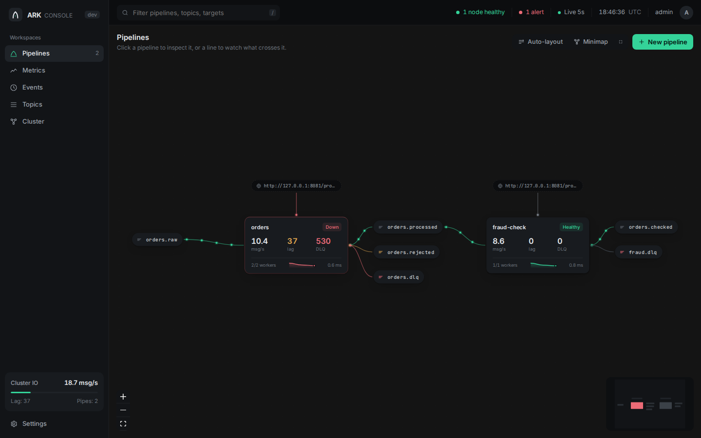
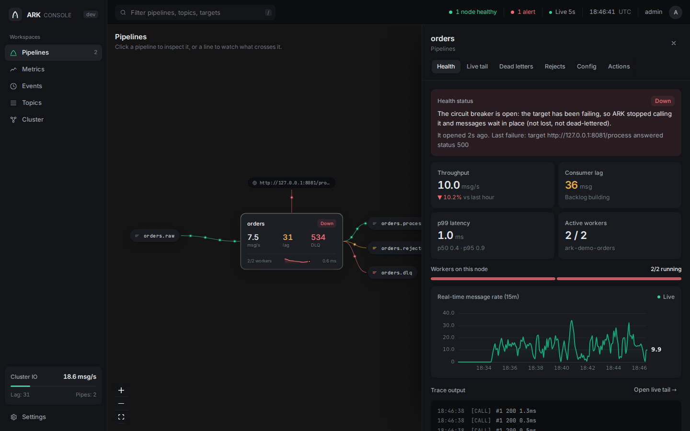
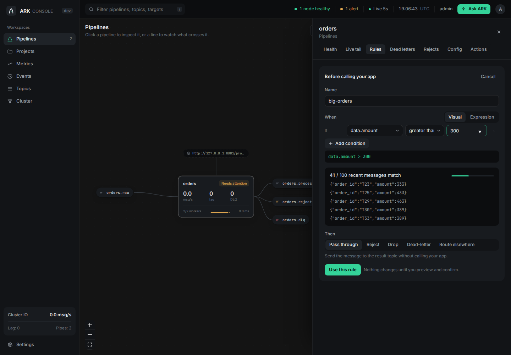
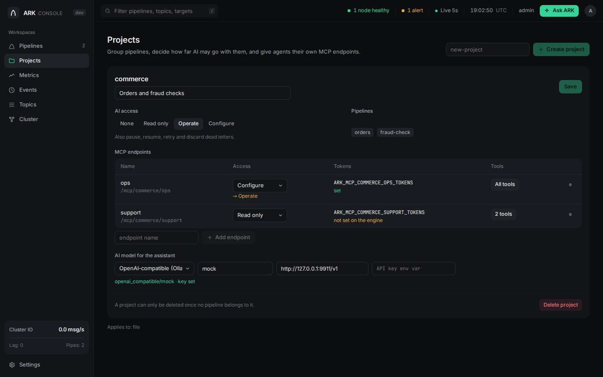
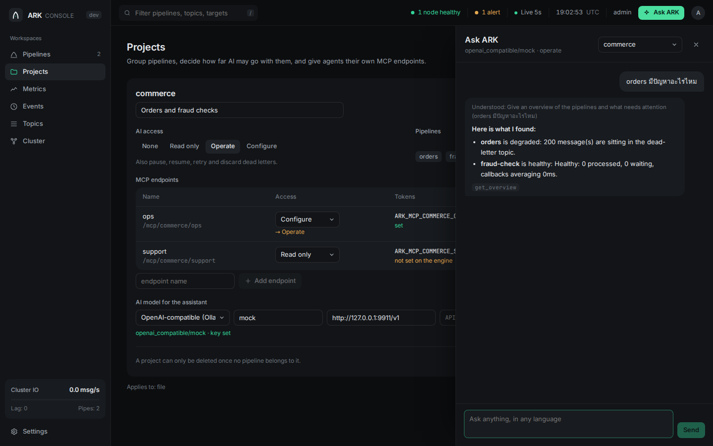
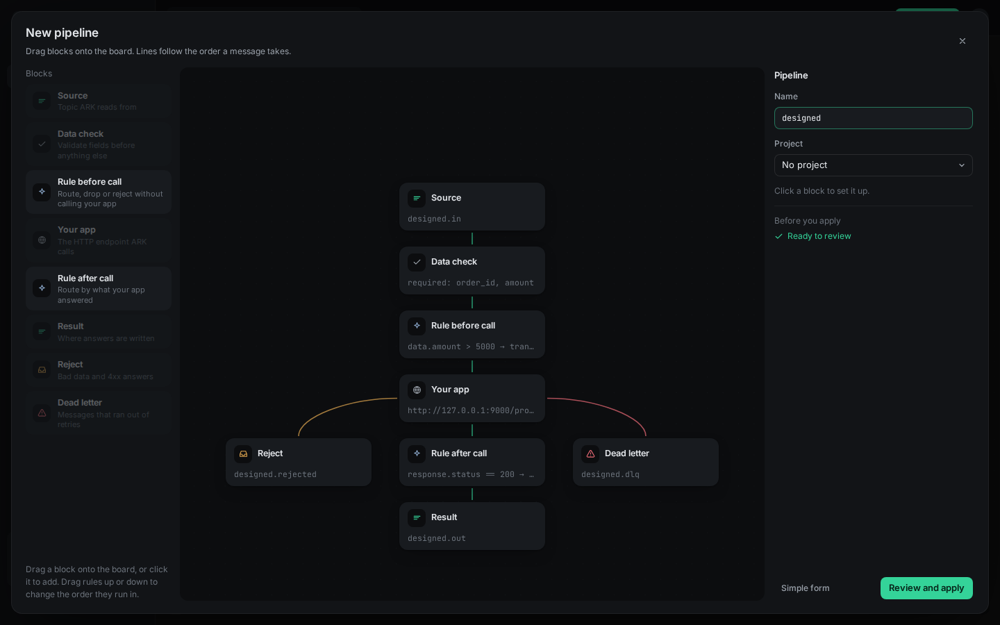
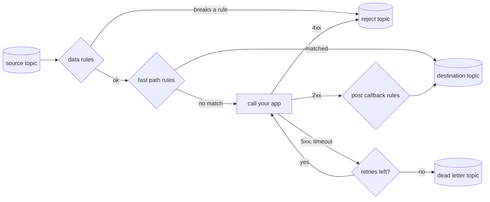

<p align="center">
  <picture>
    <source media="(prefers-color-scheme: dark)" srcset="brand/ark-wordmark.svg">
    
  </picture>
</p>

<h3 align="center">Connect any Kafka topic to any HTTP app.<br>No Kafka client code. Nothing lost.</h3>

<p align="center">
  <a href="https://github.com/raven-clown/ark/actions/workflows/ci.yml"></a>
  
  <a href="LICENSE"></a>
  
</p>

<p align="center">
  <a href="#quick-start">Quick start</a> ·
  <a href="#how-it-works">How it works</a> ·
  <a href="#features">Features</a> ·
  <a href="#your-first-pipeline">First pipeline</a> ·
  <a href="#reference">Reference</a> ·
  <a href="https://raven-clown.github.io/ark/">Website</a>
</p>

<p align="center">
  <picture>
    <source media="(prefers-color-scheme: dark)" srcset="brand/ark-flow-dark.svg">
    
  </picture>
</p>

ARK sits between Kafka and an HTTP endpoint your app already has. It
consumes each message, checks it, calls your app, and produces the answer
to another topic. Retries, ordering, dead letters, a circuit breaker,
scaling and an AI assistant come built in. One Go binary, one YAML file.

Your app stays a plain web service. It never sees a consumer group, an
offset or a rebalance.

## Why ARK

- **Every team writes the same Kafka glue.** Consume, retry, dead-letter,
  commit offsets carefully, survive rebalances, add metrics. ARK is that
  glue, done once and tested against a real broker.
- **Small on purpose.** ARK does one job: *consume, validate or route,
  call back, produce*. It is not a general orchestrator like Kafka
  Connect, NiFi or Camel, so there is no framework to learn and no extra
  cluster to run.
- **Safe by default.** At-least-once delivery, in-order commits, a stable
  correlation ID for idempotency, and a dead-letter topic that is
  required, so a message always ends up somewhere you can see it.
- **Easy to operate.** Ask it questions in plain language over MCP, browse
  and retry dead letters from the API, and scale by adding nodes that
  coordinate through Kafka itself.

## Quick start

You need Docker. This starts Kafka, ARK, and a tiny demo app that echoes
what it receives.

```bash
git clone https://github.com/raven-clown/ark.git && cd ark
docker compose up -d --build
```

The demo pipeline (`bridge-engine/config.demo.yaml`) reads `orders.raw`,
calls the demo app, and writes the answer to `orders.processed`. It also
has a data rule: `order_id` must be a string and `amount` a number of at
least 0.

**1. Send three orders:** a good one, one that breaks the rule, and one
the app fails on.

```bash
printf '%s\n' \
  '{"order_id":"A1","amount":10}' \
  '{"order_id":"A2","amount":-5}' \
  '{"order_id":"A3","amount":7,"fail":true}' \
| docker compose exec -T kafka /opt/kafka/bin/kafka-console-producer.sh \
    --bootstrap-server localhost:9092 --topic orders.raw
```

**2. See where each one went.**

```bash
topic() { docker compose exec -T kafka /opt/kafka/bin/kafka-console-consumer.sh \
  --bootstrap-server localhost:9092 --from-beginning --timeout-ms 5000 \
  --property print.headers=true --topic "$1" 2>/dev/null; }

topic orders.processed   # A1, with the app's answer
topic orders.rejected    # A2, X-Ark-Reason: data rules: amount is -5, below the minimum 0
topic orders.dlq         # A3, X-Ark-Reason: callback failed 3 time(s) ... answered status 500
```

**3. Ask ARK about it.**

```bash
curl -s localhost:8080/api/v1/pipelines -H 'Authorization: Bearer demo-admin-token'
curl -s localhost:8080/api/v1/pipelines/orders/dlq -H 'Authorization: Bearer demo-admin-token'
```

**4. Or ask in plain language.** Connect any MCP client to
`http://localhost:8080/mcp` with the token `demo-mcp-token`. For example,
with Claude Code:

```bash
claude mcp add --transport http ark http://localhost:8080/mcp \
  --header "Authorization: Bearer demo-mcp-token"
```

Then ask *"how is the orders pipeline doing?"* or *"is there any weird
data in orders?"* in English, Thai, or Chinese. ARK answers with what is
happening, why, and what to do.

**5. Open the console.** Go to [http://localhost:8088](http://localhost:8088)
and sign in with `demo-admin-token`. You'll see the pipeline with data
flowing through it; click it to see its health, tail it live, browse dead
letters, or change its rules.

> The demo tokens are for trying ARK on your machine. Set your own with
> `ARK_API_ADMIN_TOKENS` and `ARK_MCP_ADMIN_TOKENS` before running it
> anywhere else, and point `ARK_CONFIG` at your own config file.

## ARK Console

One place to see and run everything, with no Grafana or Kafka tooling on
the side.

<p align="center">
  
</p>

- **Pipeline canvas.** Every pipeline, topic and target, chained pipelines
  joined through their shared topic. Each dot on a line is 10 real
  messages (more on busy lines, shown under the canvas); click a line to
  watch what crosses it, or right-click a pipeline for everything you can
  do with it. In cluster mode the numbers cover every node.
- **Everything about one pipeline.** Health with the reason and next step,
  throughput against the last hour, p99 latency, a live tail of every
  message (in, each callback attempt, where it went and why), dead letters
  and rejects with retry and discard, the config, and pause, restart,
  scale and delete.
- **Flow designer.** Drag steps onto a board (call your app, condition,
  webhook, send to topic, data check, reject, dead letter, drop) and draw
  lines from any way out to the next step, n8n style: a condition splits
  a message down several branches, a call has its own lines for the
  answer, a 4xx and used-up retries. Review the generated config before
  it is applied. Right-click a running pipeline to open it in the
  designer; a fixed-path pipeline opens as the flow that does the same.
- **Visual rule builder.** Pick a field from real messages, an operator and
  a value, and see how many recent messages would match before you save.
- **Metrics.** Throughput, lag and callback latency percentiles over the
  last hour, plus the node's own resources.
- **Projects.** Group pipelines, decide how far AI may go with them, give
  agents their own MCP endpoints, and choose each project's AI model.
- **Ask ARK.** Chat with an assistant backed by the model you choose. It
  works out what you mean first, asks back when it must, and uses the
  same tools as any MCP agent, within your permissions.
- **Settings.** Timezone, default AI model and every engine tuning value.
- In English, Thai, and simplified and traditional Chinese.

<table>
<tr>
<td width="50%"></td>
<td width="50%"></td>
</tr>
<tr>
<td></td>
<td></td>
</tr>
<tr>
<td colspan="2"></td>
</tr>
</table>

The console is its own small service (`bridge-ui`): it serves the web app
and forwards `/api/v1/` to an ARK engine, so the browser never talks to
Kafka. Sign in with any `ARK_API_*` token; what you can do follows its
scope.

## How it works

Every message takes the same path, and each step has one clear outcome:



1. **Consume.** Each pipeline is a Kafka consumer group. `workers` members
   share the source topic's partitions.
2. **Check.** `data_rules` validate the message (types, ranges, formats,
   required fields, key and headers) before anything else runs.
3. **Route early.** `fast_path_rules` can pass, reject, drop or
   dead-letter a message on a condition, without calling your app.
4. **Call back.** ARK POSTs the message to your app with a stable
   `X-Correlation-ID`, keeping order per key while different keys run in
   parallel.
5. **Route late.** `post_callback_rules` look at your app's answer and can
   send it to a different topic or webhook.
6. **Produce and commit.** The answer goes to the destination topic, and
   only then is the offset committed, in order.

### What happens when...

| Situation | What ARK does |
|---|---|
| Your app answers 2xx | The answer is produced to `destination_topic` |
| Your app answers 4xx | The message is bad, not the app: it goes to `reject_topic` with the reason, no retry |
| Your app answers 408, 425 or 429 | "Come back later": ARK waits (honoring `Retry-After`) and tries again without using a retry |
| Your app answers 5xx or times out | Retried with backoff, then dead-lettered with the reason |
| Your app is down | The circuit breaker opens, messages wait in Kafka, and ARK resumes the moment the health check passes |
| A message breaks a data rule | Rejected, dead-lettered, or tagged and let through, your choice |
| ARK crashes mid-message | Nothing was committed past it, so it is delivered again with the same correlation ID |
| A node joins or leaves the cluster | Workers move to the live nodes in place, without restarting pipelines |

## Features

<table>
<tr>
<td width="50%" valign="top">

**Delivery you can trust**<br>
At-least-once with in-order commits. A message that can't finish is
retried in place, never skipped. Stable correlation IDs make your app
idempotent in one line.

</td>
<td width="50%" valign="top">

**Data rules**<br>
Declare what a valid message looks like: required fields, types, ranges,
lengths, patterns, enums, formats (email, uuid, date-time, url, ipv4),
size, unknown fields, key and headers.

</td>
</tr>
<tr>
<td valign="top">

**Rules without code**<br>
Route before or after the callback with
[expr](https://expr-lang.org) conditions: auto-approve small orders,
dead-letter obvious fraud, send big orders to another topic.

</td>
<td valign="top">

**Dead letters you can act on**<br>
Browse, retry or discard DLQ and reject entries over the API, each with
its reason and time. Redrive them on a schedule with a limit. What was
handled stays handled across restarts.

</td>
</tr>
<tr>
<td valign="top">

**Built-in AI assistant (MCP)**<br>
Any MCP client can ask what is happening and why, explain an error, find
weird data, suggest tuning, and draft a pipeline that is applied only
after you confirm a preview.

</td>
<td valign="top">

**Cluster without a new dependency**<br>
Run more nodes and they act as one: shared config, cluster-wide pause, a
leader that places workers by label, fast failover. Coordination runs on
Kafka itself. No etcd, no ZooKeeper.

</td>
</tr>
<tr>
<td valign="top">

**Protects your app**<br>
Per-pipeline concurrency limits, a circuit breaker with health probes,
backpressure on 429, and load balancing over several backends
(round robin, least in flight, sticky partition).

</td>
<td valign="top">

**Secure and observable**<br>
Viewer, operator and admin tokens for the API and separately for MCP,
per-pipeline AI access, audit logs. Prometheus metrics for throughput,
latency, lag, oldest uncommitted age, breaker state and rule matches.

</td>
</tr>
</table>

## Your first pipeline

Point ARK at your own topic and endpoint. This is a complete, working
config:

```yaml
brokers: [kafka:9092]
timezone: Asia/Bangkok           # every time ARK shows you is ISO 8601 in this zone

pipelines:
  - name: order-processor
    source_topic: orders.raw
    destination_topic: orders.processed
    dead_letter_topic: orders.dlq  # required: failures always land somewhere visible
    reject_topic: orders.rejected  # optional: bad data goes here instead of the DLQ
    consumer_group: order-processor
    workers: 3                     # 3 consumers sharing the topic's partitions

    target:
      url: http://order-app:8080/process
      health_check_url: http://order-app:8080/health

    retry:
      max_attempts: 3
      backoff_ms: 1000

    data_rules:
      on_violation: reject         # or dead_letter, or tag
      fields:
        - {path: order_id, required: true, type: string}
        - {path: amount, required: true, type: number, min: 0}
        - {path: email, format: email}

    fast_path_rules:
      - name: auto-approve-small
        condition: "data.amount < 100"
        action: pass_through
```

Run it:

```bash
docker run -v $PWD/config.yaml:/etc/bridge/config.yaml -p 8080:8080 \
  -e ARK_API_ADMIN_TOKENS=change-me ark   # built from bridge-engine/Dockerfile
# or: cd bridge-engine && go run ./cmd/bridge -config config.yaml
```

ARK creates the source, dead-letter and reject topics if they are missing,
hot-reloads the file when you call
`POST /api/v1/config/reload`, and refuses an invalid config before it
touches a running pipeline. Every option is documented in
[`config.example.yaml`](bridge-engine/config.example.yaml).

Your app receives a normal HTTP POST:

```http
POST /process HTTP/1.1
Content-Type: application/json
X-Correlation-ID: 30176dd15e71f315051f562780bb548d

{"order_id":"A1","amount":10}
```

Whatever it returns with a 2xx becomes the message on
`destination_topic`.

## Reference

<details>
<summary><b>Delivery guarantees in detail</b></summary>

- **Offsets commit only after the result is produced**, and in order. A
  message that can't be completed blocks the commits behind it on its
  partition until it is, so a crash can never skip it. Killing ARK
  mid-message means it is delivered again.
- **`X-Correlation-ID`** is derived from topic, partition and offset, so a
  retry or a redelivery after a crash carries the same ID. Delivery is
  at-least-once; use the ID as an idempotency key.
- **Ordering.** `ordering: per_key` (default) sends messages with the same
  key one at a time and in order, while different keys run in parallel.
  `per_partition` and `none` are also available.
- **Status codes.** 4xx means the message is the problem: it goes to
  `reject_topic` (or the DLQ without one) with no retry. 408, 425 and 429
  mean "later": ARK waits, honoring `Retry-After`, without spending a
  retry. `target.reject_statuses` overrides which codes are rejects.
- **When the app is down,** the circuit breaker opens after
  `circuit_breaker.failure_threshold` different messages fail in a row and
  messages wait in Kafka instead of flooding the DLQ. Retries of a message
  that already failed don't count again, so a few messages your app always
  fails on can't hold up the rest. With `health_check_url` set, ARK
  resumes as soon as the app answers.
- **`on_exhausted: block`** keeps retrying forever instead of
  dead-lettering, for pipelines where order matters more than progress.
- Every routed message carries `X-Ark-Reason`, `X-Ark-Pipeline` and
  `X-Ark-Failed-At` headers so you can see why it ended up there.

</details>

<details>
<summary><b>Data rules</b></summary>

```yaml
data_rules:
  on_violation: tag              # reject (default) | dead_letter | tag
  allow_unknown_fields: false    # flag top-level fields no rule mentions
  max_bytes: 65536
  key: {required: true, pattern: "^[A-Z]{2}-\\d+$"}
  headers:
    - {name: source, enum: [web, mobile, pos]}
  fields:
    - {path: order_id, required: true, type: string, max_length: 32}
    - {path: amount, type: number, min: 0, max: 1000000}
    - {path: currency, enum: [THB, USD, EUR]}
    - {path: customer.email, format: email}
    - {path: created_at, format: date-time}
```

Types: `string`, `number`, `integer`, `boolean`, `object`, `array`,
`null`. Formats: `email`, `uuid`, `date-time`, `date`, `url`, `ipv4`.
With `on_violation: tag` the message goes through with an
`X-Ark-Violations` header, a safe way to start. Not sure what to write?
Ask the assistant to `check_data` on a pipeline: it samples real
messages, reports odd fields, mixed types, outliers and bad keys, and
drafts the rules for you.

</details>

<details>
<summary><b>Fast path and post-callback rules</b></summary>

```yaml
fast_path_rules:                  # before the callback
  - name: auto-approve-small-orders
    condition: "data.amount < 1000 && data.risk_score < 0.3"
    action: pass_through          # pass_through | reject | drop | dead_letter
  - name: obvious-fraud
    condition: "data.risk_score > 0.9"
    action: dead_letter

post_callback_rules:              # after the callback, on its answer
  - name: high-value-order-alert
    condition: "response.status == 200 && response.body.amount > 10000"
    action: transform_route
    destination_override: orders.high-value   # or webhook_override: http://...
```

Conditions use [expr](https://expr-lang.org) syntax (`nil`, not `null`).

</details>

<details>
<summary><b>Flows: steps joined in any shape</b></summary>

When a fixed path isn't enough, give a pipeline a `flow:` instead of a
target and rules. Every step can lead to several others, conditions can
split a message anywhere, and an app's answer, a reject status and
used-up retries each go their own way:

```yaml
flow:
  start: [check]
  steps:
    - {id: check, type: data_check, rules: {fields: [{path: order_id, required: true}]}, next: [route], on_fail: [bad]}
    - id: route
      type: condition
      match: all                      # or first
      branches:
        - {when: "data.amount > 1000", next: [vip-topic, crm]}
      otherwise: [app]
    - {id: vip-topic, type: topic, topic: orders.vip, next: [app]}
    - {id: crm, type: webhook, url: "http://crm:8080/notify"}
    - {id: app, type: call, target: {url: "http://order-app:8080/process"}, next: [after], on_reject: [bad], on_failure: [later]}
    - id: after
      type: condition
      branches:
        - {when: "response.body.total > 10000", next: [big]}
      otherwise: [done]
    - {id: big, type: topic, topic: orders.big}
    - {id: done, type: topic, topic: orders.processed}
    - {id: later, type: topic, topic: orders.retry}
    - {id: bad, type: reject}
```

Steps: `call`, `condition`, `data_check`, `topic`, `webhook`, `reject`,
`dead_letter`, `drop`. Conditions read `data` (the message at that step),
`original`, `response` (`status` and `body` of the last call), `reason`,
`key` and `headers`. Every step but `drop` can lead on to more steps,
reject and dead letter included, so a reject can also go to a webhook or
another app. Call steps take the same `target`, `retry` and
`circuit_breaker` options as the fixed path. Loops are refused; to go
around again, send to a topic a pipeline reads. A message is committed
once every path it took is done.

</details>

<details>
<summary><b>Dead letters and redrive</b></summary>

- `GET /api/v1/pipelines/{name}/dlq` lists recent entries with reason,
  time, correlation ID and redrive count.
- `POST .../dlq/{id}/retry` sends the message through the pipeline again
  (rules and all); `POST .../dlq/{id}/discard` removes it from the list.
- The same routes exist under `.../reject`.
- What was retried or discarded is recorded in Kafka, so it stays handled
  after a restart and can't be retried twice.
- `dead_letter_redrive: {after_seconds: 3600, max_times: 3}` retries dead
  letters on a schedule and leaves the rest for a human.

</details>

<details>
<summary><b>Several backends for one pipeline</b></summary>

```yaml
target:
  mode: multi_url
  urls:
    - http://order-app-1:8080/process
    - http://order-app-2:8080/process
  health_check_urls:
    - http://order-app-1:8080/health
    - http://order-app-2:8080/health
  strategy: round_robin   # or least_inflight, sticky_partition
```

Each URL is probed on its own and only healthy ones get traffic. If every
URL is down, messages wait in Kafka. `sticky_partition` keeps a partition
on the same backend while it stays healthy.

</details>

<details>
<summary><b>AI assistant over MCP</b></summary>

Set `ARK_MCP_VIEWER_TOKENS`, `ARK_MCP_OPERATOR_TOKENS` or
`ARK_MCP_ADMIN_TOKENS` (comma-separated) and ARK serves MCP at `/mcp` on
the API port. Any MCP client and any model can use it.

| Ask | Tool the assistant uses |
|---|---|
| "Hi, what can you do?" | `get_help`, `get_overview` |
| "Why is orders slow?" | `diagnose_pipeline`: what, why, what to do |
| "What does this error mean?" | `explain_error`: where it comes from and the fix |
| "What happened at 3am?" | `get_recent_events` |
| "Any weird data coming in?" | `check_data`, `test_message` |
| "How do I handle 2000 msg/s?" | `recommend_tuning` |
| "Create a pipeline from A to B" | `get_pipeline_schema`, `validate_pipeline_config`, `create_pipeline` |

Every conversation starts with `interpret_request`, which works out what
you mean (Thai, English, simplified and traditional Chinese, plus your
own words through `assistant.lexicon`) and which pipeline you are talking
about, and asks back when something is unclear.

Access is layered. A token's scope is a ceiling: `viewer` reads,
`operator` also pauses, resumes, retries and discards, `admin` also
creates and changes pipelines. Each pipeline's `mcp_access`
(`read_only`, `read_write`, `none`) is a second limit. Config changes are
two steps: the first call returns a preview and a diff, and only a second
call with the confirm token applies it. Every write is audit-logged.

</details>

<details>
<summary><b>Projects and AI access</b></summary>

```yaml
projects:
  - name: commerce
    ai_access: operate           # none | read_only | operate | configure
    mcp_endpoints:
      - name: ops                # served at /mcp/commerce/ops
        access: operate
        tokens_env: ARK_MCP_COMMERCE_OPS_TOKENS
      - name: support
        access: read_only
        tokens_env: ARK_MCP_COMMERCE_SUPPORT_TOKENS
        tools: [get_overview, diagnose_pipeline, explain_error]
    assistant: {provider: anthropic, model: claude-opus-5, api_key_env: ANTHROPIC_API_KEY}

pipelines:
  - name: orders
    project: commerce
    # ...
```

A project's `ai_access` is a ceiling everywhere, the global `/mcp`
included: `none` hides its pipelines from agents, `read_only` lets them
look but not touch, `operate` adds pause, resume, retry and discard, and
`configure` adds creating and changing pipelines (always after a
confirmed preview). Each endpoint gets its own tokens from the
environment variable it names, never from the file, and only sees its
project. Projects can be managed from the console.

</details>

<details>
<summary><b>The assistant, with any model</b></summary>

Set a default model under `assistant.model`, or one per project:

| Provider | Example |
|---|---|
| Anthropic | `{provider: anthropic, model: claude-opus-5}` (key from `ANTHROPIC_API_KEY`) |
| OpenAI | `{provider: openai, model: gpt-5}` (key from `OPENAI_API_KEY`) |
| Google Gemini | `{provider: gemini, model: gemini-2.5-pro}` (key from `GEMINI_API_KEY`) |
| Anything OpenAI-compatible | `{provider: openai_compatible, model: qwen3, base_url: "http://localhost:11434/v1"}` (DeepSeek, Mistral, Groq, OpenRouter, Together, Azure OpenAI, Ollama, vLLM, LM Studio, ...) |

`api_key_env` changes which variable holds the key. The console's Ask ARK
panel (and `POST /api/v1/assistant/chat`) answers in two passes: first
the model restates what you mean, or asks one question back; then it
looks things up and acts through ARK's MCP tools. Its permissions are the
lower of your API token's scope and the project's `ai_access`.

</details>

<details>
<summary><b>Tuning</b></summary>

Every internal limit and interval has a default and can be changed under
`tuning:` in the config or on the console's Settings page: retry backoff
and Retry-After caps, commit and batch timeouts, DLQ browser size,
diagnosis thresholds, metric history, event log size, live tail payload
size, confirm token and assistant session lifetimes, and cluster
catch-up. See [`config.example.yaml`](bridge-engine/config.example.yaml)
for the full list with defaults.

</details>

<details>
<summary><b>Running more than one ARK</b></summary>

Without anything special, more copies with the same `consumer_group`
already split the work. Turn on cluster mode to make them act as one:

```yaml
cluster:
  enabled: true
  name: prod            # namespaces ARK's internal topics
  labels: {zone: dmz}   # used by placement.node_selector
```

- **One config.** Pipeline config lives in a compacted Kafka topic. A
  reload on any node reaches every node, and an invalid config is
  refused before it spreads.
- **One control surface.** Pause through any node and the pipeline pauses
  everywhere. `GET /api/v1/cluster/pipelines` returns cluster-wide
  numbers with a per-node breakdown, and any node can browse and retry
  any pipeline's DLQ.
- **Placement.** An elected leader spreads each pipeline's workers across
  live nodes matching `placement.node_selector`, never more than the topic
  has partitions, and adds or removes workers in place.
- **Failover.** A node that stops cleanly hands over in about a second; one
  that crashes is replaced after `node_timeout_seconds`.

</details>

<details>
<summary><b>REST API</b></summary>

Every route except `/healthz` and `/metrics` needs a bearer token.
`ARK_API_VIEWER_TOKENS` can read, `ARK_API_OPERATOR_TOKENS` can also
pause, resume, restart, retry and discard, and `ARK_API_ADMIN_TOKENS` can
also change config (preview, confirm, scale, reload). With none set, the API only answers localhost. These are
separate from the MCP tokens.

| Route | What it does |
|---|---|
| `GET /healthz` | Liveness |
| `GET /metrics` | Prometheus metrics |
| `GET /api/v1/pipelines` | Status of every pipeline worker |
| `GET /api/v1/pipelines/{name}` | Status of one pipeline |
| `POST /api/v1/pipelines/{name}/pause`, `/resume` | Pause or resume |
| `GET /api/v1/pipelines/{name}/dlq`, `/reject` | Recent entries |
| `GET .../dlq/{id}`, `.../reject/{id}` | One entry |
| `POST .../dlq/{id}/retry`, `/discard` | Retry or discard (same under `/reject`) |
| `POST /api/v1/config/reload` | Re-read the config |
| `GET /api/v1/cluster` | Members, leader, config versions |
| `GET /api/v1/cluster/pipelines` | Cluster-wide pipeline numbers |
| `GET /api/v1/overview` | Health of every pipeline and what needs attention |
| `GET /api/v1/events` | What happened and why (`pipeline`, `since_minutes`, `kinds`, `limit`) |
| `GET /api/v1/topology` | How pipelines, topics and targets connect |
| `GET /api/v1/topics` | Kafka topics and which pipelines use them |
| `GET /api/v1/pipelines/{name}/tail` | Live tail as Server-Sent Events (`stage`, `to`, `key`, `correlation_id`, `max_per_sec`) |
| `GET /api/v1/pipelines/{name}/diagnosis`, `/tuning`, `/data-check` | What's wrong and why, sizing advice, odd data |
| `POST /api/v1/pipelines/{name}/test-message` | What the pipeline would do with a message |
| `POST /api/v1/pipelines/{name}/restart` | Restart its workers on this node |
| `POST /api/v1/pipelines/{name}/scale` | Change `workers` (admin) |
| `GET /api/v1/config/pipelines`, `/config/schema` | Current config as YAML, and the schema |
| `POST /api/v1/config/validate` | Check a pipeline without applying it |
| `POST /api/v1/config/preview`, `/config/confirm` | Create, change or delete a pipeline in two steps (admin) |
| `GET /api/v1/pipelines/{name}/rules`, `POST .../rules/test`, `.../rules/preview` | Read rules, test a condition on recent messages, change rules (admin) |
| `GET /api/v1/history` | Per-pipeline rates, lag and latency percentiles over the last hour |
| `GET /api/v1/projects`, `PUT`/`DELETE /api/v1/config/projects/{name}` | Projects, their endpoints and models (changes need admin) |
| `POST /api/v1/assistant/chat` | Ask the assistant (acts within your scope) |
| `GET`/`PUT /api/v1/config/settings` | Timezone, default model and tuning (changes need admin) |

</details>

<details>
<summary><b>Metrics</b></summary>

`ark_messages_processed_total`, `ark_messages_rejected_total`,
`ark_messages_dead_lettered_total`, `ark_messages_failed_total`,
`ark_messages_backpressured_total`, `ark_callback_duration_seconds`,
`ark_data_rule_violations_total`, `ark_consumer_lag`,
`ark_oldest_uncommitted_age_seconds`, `ark_circuit_breaker_open`,
`ark_pipeline_paused`, `ark_worker_up`,
`ark_last_activity_timestamp_seconds`, `ark_fast_path_rule_matches_total`,
`ark_post_callback_rule_matches_total`. All labeled by pipeline and
tenant.

</details>

## Roadmap

- **Longer history:** keep metrics beyond the last hour and per partition.
- **Batched callbacks:** send several messages per HTTP call for targets
  that support it.

The full plan, with the reasoning behind every decision, is in
[PLAN.md](PLAN.md).

## Repository

| Path | What's there |
|---|---|
| [`bridge-engine/`](bridge-engine) | The Go engine: consumer, rules, callback client, producer, REST API, MCP server, cluster |
| [`bridge-ui/`](bridge-ui) | The ARK Console: a React app and a small Go server |
| [`brand/`](brand) | Logo and colors |
| [`docs/`](docs) | The website |

## Contributing

Issues and pull requests are welcome. Read
[CONTRIBUTING.md](CONTRIBUTING.md) for the dev setup and where ARK's scope
is deliberately bounded, which is worth a look before proposing something
big.

## License

[Apache License 2.0](LICENSE)
