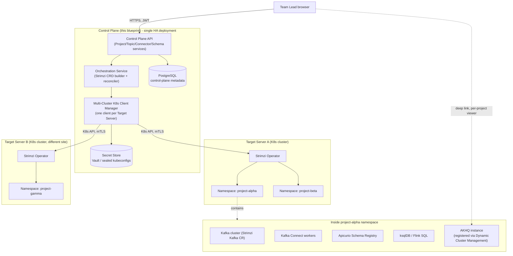
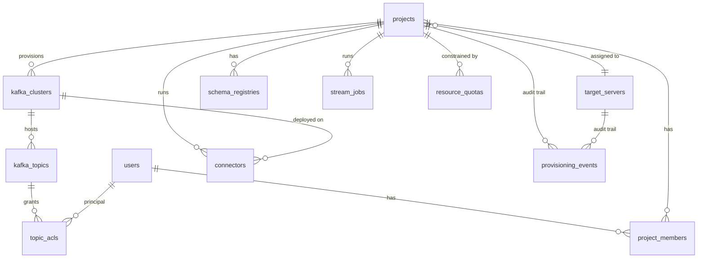
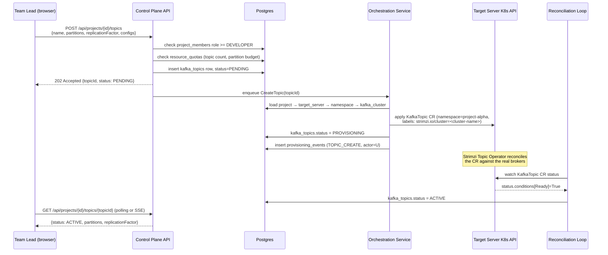

# Multi-Tenant Kafka Control Plane - Architecture Blueprint

> **Status: shelved.** After this was written, the actual decision was to drop the
> Kubernetes/Strimzi provisioning layer entirely - too much operational complexity for what was
> needed. What got built instead is a much smaller **logical** Project layer: no target servers,
> no namespace-per-team, no infrastructure provisioning at all. See
> `docs/enterprise/architecture-blueprint.md`, "Projects - logical multi-tenancy" for what's
> actually implemented and compiling today. This document stays as reference in case real
> per-team infrastructure isolation becomes a real requirement later - the analysis here (the
> `KafkaModule` chokepoint investigation especially) is still accurate, just not being built.

Rancher-style, on-premise, multi-cluster control plane for provisioning and governing isolated
Kafka "Projects" across target Kubernetes clusters via the Strimzi Kafka Operator. This is a
**separate initiative from `docs/enterprise/architecture-blueprint.md`** (the AKHQ + Employee RBAC
work already built) - not its next phase. Relationship between the two is covered at the end.

## 0. Where this sits relative to what already exists

| | Already built (AKHQ fork) | This blueprint |
|---|---|---|
| Tenancy | Single tenant, one shared UI | Multi-tenant: isolated Project per team |
| Kafka clusters | Pre-existing, statically configured | **Provisioned on demand** via Strimzi CRDs |
| Target infra | One deployment, no K8s orchestration | Multiple registered K8s clusters/servers |
| Scope of RBAC | Who can view/act on existing clusters | Who can view/act **+ who can create/own a Project** |
| Role of AKHQ | The whole product | Becomes the **data-plane viewer**, registered per project via the Dynamic Cluster Management work already scaffolded |

Nothing here replaces the employee/RBAC module - it's the identity source this control plane
reuses (see §7).

## 1. High-level architecture



**Control Plane** - one HA service the whole organization talks to. Owns all metadata in Postgres,
never talks to Kafka brokers directly; everything it does to a project's infrastructure goes
through the Kubernetes API of that project's Target Server.

**Data Plane** - one Kubernetes Namespace per Project, on whichever Target Server the project was
assigned to at creation time. Strimzi must be pre-installed on every registered Target Server (a
prerequisite the control plane checks, not something it installs).

## 2. Database schema (PostgreSQL)



### `target_servers`
The pool of Kubernetes clusters/servers a Project can be deployed onto. Registered once by a
platform admin, not per-project.

| column | type | notes |
|---|---|---|
| id | uuid pk | |
| name | varchar(128) unique | e.g. `on-prem-dc1`, `on-prem-dc2` |
| description | text | |
| k8s_api_url | varchar(512) | control-plane's own endpoint for the target's K8s API |
| kubeconfig_secret_ref | varchar(256) | pointer into the secret store - **never** the raw kubeconfig in this table |
| strimzi_installed_version | varchar(32) | checked on registration + periodic health check |
| region_or_site | varchar(64) | for placement policy / data residency |
| capacity_labels | jsonb | e.g. `{"tier":"gpu","storageClass":"nvme"}`, used for placement rules |
| status | varchar(16) | `ACTIVE`, `DRAINING`, `UNREACHABLE` |
| created_by | varchar(64) FK → employees.employee_code | reuses the existing employee identity |
| created_at, updated_at | timestamp | |

### `projects`
| column | type | notes |
|---|---|---|
| id | uuid pk | |
| name | varchar(128) | display name |
| slug | varchar(64) unique | used as the K8s namespace name - `project-<slug>` |
| owner_user_id | varchar(64) FK → employees.employee_code | the Project Owner |
| target_server_id | uuid FK → target_servers | chosen at creation, **immutable** (moving a project across servers is a migration, not an update) |
| namespace | varchar(64) | usually `project-<slug>`, stored explicitly in case of collision-avoidance suffixing |
| status | varchar(24) | `PENDING`, `PROVISIONING`, `ACTIVE`, `SUSPENDED`, `DELETING`, `FAILED` |
| kafka_replicas | int | default cluster size requested |
| storage_size_gb | int | per-broker PVC size requested |
| created_at, updated_at | timestamp | |

### `project_members`
| column | type | notes |
|---|---|---|
| project_id | uuid FK → projects | |
| user_id | varchar(64) FK → employees.employee_code | |
| project_role | varchar(16) | `OWNER`, `MAINTAINER`, `DEVELOPER`, `VIEWER` - fixed capability matrix, see §3 |
| added_by | varchar(64) | |
| added_at | timestamp | |
| - | | primary key `(project_id, user_id)` |

### `kafka_clusters`
A project usually has one, but the schema allows more (e.g. a `dev` and a `staging` Strimzi
`Kafka` CR inside the same namespace).

| column | type | notes |
|---|---|---|
| id | uuid pk | |
| project_id | uuid FK → projects | |
| strimzi_cluster_name | varchar(64) | the `metadata.name` of the Strimzi `Kafka` CR |
| bootstrap_servers | varchar(512) | filled in once Strimzi reports the cluster Ready |
| kafka_version | varchar(16) | |
| status | varchar(24) | mirrors the Strimzi CR's `status.conditions` |
| last_reconciled_at | timestamp | last time the control plane polled/watched the CR |

### `kafka_topics`
| column | type | notes |
|---|---|---|
| id | uuid pk | |
| kafka_cluster_id | uuid FK → kafka_clusters | |
| name | varchar(255) | |
| partitions | int | |
| replication_factor | int | |
| config_json | jsonb | `retention.ms`, `cleanup.policy`, etc. |
| status | varchar(24) | mirrors the Strimzi `KafkaTopic` CR |
| created_by | varchar(64) | |
| created_at | timestamp | |
| - | | unique `(kafka_cluster_id, name)` |

### `topic_acls`
This is the per-topic authorization table the "grant read/write access to specific Kafka Topics"
requirement maps to - deliberately separate from `project_members`, because topic access is
finer-grained than project membership (a `VIEWER` might still get `WRITE` on one specific topic a
Maintainer explicitly grants).

| column | type | notes |
|---|---|---|
| id | uuid pk | |
| topic_id | uuid FK → kafka_topics | |
| principal_type | varchar(16) | `USER` or `PROJECT_ROLE` (grant to everyone holding a role, not just one person) |
| principal_id | varchar(64) | employee_code, or the role name when principal_type=PROJECT_ROLE |
| permission | varchar(16) | `READ` (consume), `WRITE` (produce), `DESCRIBE`, `ALTER_CONFIG`, `ALL` |
| granted_by | varchar(64) | |
| granted_at | timestamp | |

### `connectors`
| column | type | notes |
|---|---|---|
| id | uuid pk | |
| project_id | uuid FK → projects | |
| kafka_cluster_id | uuid FK → kafka_clusters | |
| name | varchar(128) | |
| connector_type | varchar(16) | `SOURCE`, `SINK` |
| connector_class | varchar(255) | e.g. `io.debezium.connector.mysql.MySqlConnector` |
| config_json | jsonb | the connector config map - **secrets referenced, never inlined** (see §5) |
| status | varchar(24) | mirrors the Strimzi `KafkaConnector` CR `status.connectorStatus.state` |
| created_by | varchar(64) | |
| created_at, updated_at | timestamp | |

### `schema_registries`
| column | type | notes |
|---|---|---|
| id | uuid pk | |
| project_id | uuid FK → projects | one per project, provisioned alongside the Kafka cluster |
| type | varchar(16) | `APICURIO` |
| internal_url | varchar(512) | in-cluster service URL, used by connectors/apps inside the namespace |
| external_url | varchar(512) | nullable - only if exposed via Ingress for the schema-registry UI/API |
| status | varchar(24) | |

### `stream_jobs`
| column | type | notes |
|---|---|---|
| id | uuid pk | |
| project_id | uuid FK → projects | |
| engine | varchar(16) | `KSQLDB`, `FLINK_SQL` |
| name | varchar(128) | |
| sql_text | text | |
| status | varchar(24) | |
| created_by | varchar(64) | |

### `resource_quotas`
Enforces "hard resource limits" per namespace - mirrored into a K8s `ResourceQuota` object at
provisioning time, and re-checked before allowing new topics/connectors so the control plane fails
fast instead of letting Kubernetes reject the request after the fact.

| column | type | notes |
|---|---|---|
| project_id | uuid pk, FK → projects | |
| max_topics | int | |
| max_partitions_total | int | |
| max_connectors | int | |
| max_storage_gb | int | |
| max_cpu_millicores | int | |
| max_memory_mb | int | |

### `provisioning_events`
Append-only log of every control-plane action against a target cluster - separate from the
employee-module's `akhq-audit` topic (§7) because this needs to survive even if a project's Kafka
cluster itself is gone, and because it's queried by target server for ops/incident review, not
just by employee.

| column | type | notes |
|---|---|---|
| id | uuid pk | |
| project_id | uuid FK → projects, nullable | null for target-server-level events |
| target_server_id | uuid FK → target_servers | |
| event_type | varchar(32) | `PROJECT_CREATE`, `TOPIC_CREATE`, `CONNECTOR_DEPLOY`, `RECONCILE_FAILED`, ... |
| actor | varchar(64) | employee_code |
| detail_json | jsonb | the CRD diff / applied manifest / error |
| created_at | timestamp | |

## 3. Project role capability matrix

| Capability | OWNER | MAINTAINER | DEVELOPER | VIEWER |
|---|---|---|---|---|
| Delete project | ✓ | | | |
| Add/remove members, change roles | ✓ | ✓ (not OWNER) | | |
| Create/delete topics | ✓ | ✓ | ✓ | |
| Grant topic-level ACLs | ✓ | ✓ | | |
| Deploy/delete connectors | ✓ | ✓ | ✓ | |
| Edit stream jobs (ksqlDB/Flink SQL) | ✓ | ✓ | ✓ | |
| Produce/consume (subject to `topic_acls`) | ✓ | ✓ | ✓ | ✓ (if granted) |
| View project (topics, connectors, metrics) | ✓ | ✓ | ✓ | ✓ |

A platform-level `ROLE_ADMIN`/`ROLE_SUPER_ADMIN` from the existing employee module sits above all
of this - can see/administer every project regardless of membership, register Target Servers, and
set default `resource_quotas`. Project roles never grant Target Server registration or
cross-project visibility; that stays platform-admin-only.

## 4. Backend components

- **Control Plane API** - the HTTP surface (`/api/projects`, `/api/projects/{id}/topics`, etc.).
  Thin: validates, authorizes, writes to Postgres, and enqueues work for the Orchestration Service.
  Never talks to Kubernetes directly.
- **Orchestration Service** - owns the mapping from a control-plane intent (`create topic X`) to a
  Kubernetes/Strimzi custom resource, and the reverse (CRD status → DB row status). Stateless;
  everything it needs is in Postgres and the target cluster.
- **Multi-Cluster K8s Client Manager** - holds one authenticated Kubernetes client per
  `target_servers` row, built from a kubeconfig pulled from the secret store on demand (never
  cached to disk). Short-lived client per request, or a small pool with TTL - not one long-lived
  client per cluster held in memory indefinitely, to limit blast radius if the control plane
  process is compromised.
- **Reconciliation Loop** - a background poller (or a real Kubernetes controller using
  client-go/fabric8's informer pattern, if built in Go/Java-with-fabric8) that watches each managed
  CRD's `status.conditions` across every target cluster and updates the corresponding Postgres row.
  This is what turns `PROVISIONING` into `ACTIVE` without the API request itself blocking on
  cluster provisioning time.
- **Secret Store** - target-cluster kubeconfigs, connector credentials (DB passwords, S3 keys)
  referenced by `connectors.config_json` but stored here, injected into the Strimzi `KafkaConnector`
  CR as a reference to a K8s `Secret` the control plane creates in the project's namespace - the
  actual secret value is never round-tripped through the control-plane API response.

## 5. Security model

- **Namespace isolation**: every Project gets its own namespace; a `NetworkPolicy` applied at
  provisioning time denies cross-namespace traffic by default, with explicit allow rules only for
  what the project's own Kafka/Connect/Registry components need to talk to each other.
- **ResourceQuota + LimitRange**: mirrors `resource_quotas` - enforced by Kubernetes itself, not
  just the control plane's pre-check, so a bug in the control plane can't blow through the limit.
- **Target-cluster credentials**: least-privilege K8s `ServiceAccount` per Target Server, scoped via
  `ClusterRole`/`RoleBinding` to only the verbs/resources the control plane actually needs
  (`Kafka`, `KafkaTopic`, `KafkaConnect`, `KafkaConnector`, `KafkaUser`, `Namespace`,
  `NetworkPolicy`, `ResourceQuota` - not cluster-admin). Kubeconfig for that ServiceAccount is what
  gets stored in the secret store, not a cluster-admin credential.
- **Connector secrets**: never stored in `connectors.config_json` in plaintext - the control plane
  writes them to a K8s `Secret` in the project namespace and references it by name in the CRD,
  exactly the pattern Strimzi's own docs recommend for `KafkaConnector` credentials.
- **Kafka-level auth**: Strimzi `KafkaUser` CRs (SCRAM-SHA-512 or mTLS, per project policy) issued
  per project-member who needs direct broker access (e.g. for a local consumer); `topic_acls` in
  Postgres is the control plane's own authorization layer for **API-mediated** access (AKHQ,
  connector configs) and is separately translated into Strimzi `KafkaUser.spec.authorization.acls`
  for **direct broker** access, so both paths enforce the same grants.

## 6. Conceptual flow - "Create New Topic"



## 7. Conceptual flow - "Deploy Connector"

Same shape as topic creation, with one extra precondition step and a secret-handling step:

1. Authorize: `project_members` role ≥ MAINTAINER (connectors touch external systems - higher bar
   than topic creation).
2. **Ensure a `KafkaConnect` worker pool exists for the project** - if `connectors` is the first
   one for this project, the Orchestration Service first applies a `KafkaConnect` CR (worker
   deployment) before the individual `KafkaConnector`; subsequent connectors reuse it.
3. Extract any credential fields from the submitted config (DB password, S3 secret key), write them
   to a K8s `Secret` in the project namespace, and replace those fields in `config_json` with a
   `secretKeyRef` before persisting - the plaintext value is never written to Postgres.
4. Apply the `KafkaConnector` CR referencing the worker pool and the secret.
5. Reconciliation Loop watches `status.connectorStatus.state` (`RUNNING`, `FAILED`, `PAUSED`) and
   mirrors it into `connectors.status`; a `FAILED` state also writes a `provisioning_events` row
   with the Connect worker's error trace for the UI to surface.

## 8. Relationship to the AKHQ + Employee RBAC work already built

Three concrete connection points:

1. **Identity**: `users`/`project_members.user_id` above are the same `employees.employee_code`
   already in `kafka-control-platform`'s database - this control plane does not invent a second
   user system. A platform admin in the existing module is who registers Target Servers and can
   see every project.
2. **Data-plane viewing**: once a project's `kafka_clusters` row reaches `ACTIVE` with a real
   `bootstrap_servers`, that's exactly the input the already-built-but-not-wired
   **Dynamic Cluster Management** feature (`ClusterConnectionService`, `/api/admin/cluster-connections`)
   needs. The `KafkaModule` hot-reload wiring flagged as deferred in the other blueprint is the
   same piece of work this control plane needs to register a newly-provisioned project cluster into
   AKHQ automatically instead of a human pasting YAML - building it once serves both blueprints.
3. **Audit trail**: `provisioning_events` here is infrastructure-lifecycle audit (create/delete
   topic, deploy connector); AKHQ's own `akhq-audit` topic (already wired to the Audit Log Viewer)
   is data-plane action audit (who produced/consumed/changed config on an existing topic). Both are
   filterable by the same `employee_code`/team, so the Audit Log Viewer UI is a natural place to
   surface both once this control plane exists, not two separate screens.

## 9. Kafka Connect worker pool management

Confluent lets you size, scale, and control the plugin catalog of Connect workers independently of
any one connector; that needs its own table rather than folding pool settings into `connectors`.

### `connect_worker_pools`
| column | type | notes |
|---|---|---|
| id | uuid pk | |
| project_id | uuid FK → projects | |
| kafka_cluster_id | uuid FK → kafka_clusters | |
| strimzi_connect_name | varchar(64) | the `metadata.name` of the Strimzi `KafkaConnect` CR |
| replicas | int | worker count |
| cpu_request, cpu_limit | varchar(16) | K8s quantity strings, e.g. `500m` |
| memory_request, memory_limit | varchar(16) | e.g. `1Gi` |
| allowed_plugins | jsonb | array of `{name, artifact, version}` - controls what `connector_class` values §7's deploy flow will accept for this pool, and drives the init-container/image build that installs those plugins |
| autoscaling_enabled | boolean | if true, replicas becomes a floor and the Orchestration Service manages a K8s `HorizontalPodAutoscaler` targeting worker CPU/consumer-lag |
| status | varchar(24) | mirrors the Strimzi CR |

### `connector_plugin_catalog`
A platform-admin-curated allowlist, independent of any one project, that populates the dropdown a
Maintainer picks from in §7 step 1 (rather than a free-text `connector_class`) - this is what makes
"Deploy Connector" a form, not a YAML-authoring exercise.

| column | type | notes |
|---|---|---|
| id | uuid pk | |
| display_name | varchar(128) | e.g. "MySQL CDC (Debezium)" |
| connector_class | varchar(255) | |
| artifact_url | varchar(512) | where the Orchestration Service pulls the plugin jar/image layer from during pool image build |
| version | varchar(32) | |
| config_schema_json | jsonb | JSON Schema describing required/optional fields, used to render the deploy form and to validate `connectors.config_json` server-side before it ever reaches Kubernetes |
| category | varchar(32) | `SOURCE`, `SINK`, `TRANSFORM` |
| approved_by | varchar(64) | platform admin who allowlisted it |

Worker pool provisioning follows the same shape as §6: `POST /api/projects/{id}/connect-pools` →
Orchestration Service applies the `KafkaConnect` CR (building/selecting an image with the pool's
`allowed_plugins` baked in) → Reconciliation Loop flips status to `ACTIVE` once ready.

## 10. Declarative config-as-code - YAML import/export

The Rancher behavior being asked for specifically - "import a YAML, everything gets created;
export the current state back out" - layered on top of the API in §6-7, not a replacement for it.
The API stays the primitive; import/export is a client of that same API, doing a plan-then-apply
diff instead of one imperative call.

### Export
`GET /api/projects/{id}/manifest` returns one YAML document describing the project's desired
state - deliberately shaped like a Kubernetes manifest since that's the vocabulary this whole
platform already speaks:

```yaml
apiVersion: kafka-platform/v1
kind: ProjectManifest
metadata:
  name: project-alpha
  targetServer: on-prem-dc1
spec:
  kafkaCluster:
    replicas: 3
    storageSizeGb: 100
  topics:
    - name: orders.events
      partitions: 12
      replicationFactor: 3
      config:
        retention.ms: "604800000"
      acls:
        - principal: "team:alpha-devs"
          permission: WRITE
        - principal: "team:reporting"
          permission: READ
  connectPools:
    - name: cdc-pool
      replicas: 2
      allowedPlugins: ["debezium-mysql"]
      connectors:
        - name: orders-mysql-cdc
          class: io.debezium.connector.mysql.MySqlConnector
          config:
            database.hostname: mysql.internal
            database.secretRef: orders-db-credentials   # never the raw password
  schemaRegistry:
    enabled: true
  quotas:
    maxTopics: 50
    maxConnectors: 10
```

### Import
`POST /api/projects/{id}/manifest` (or `POST /api/projects` with no `{id}` to create-from-manifest
in one call, mirroring Rancher's "Import YAML"). Orchestration Service:
1. Parses and validates against the same `config_schema_json` used by the form-based flow - the
   manifest path and the click-a-button path share one validation layer, so neither can create
   something the other would reject.
2. Diffs the manifest against current DB state (topics to add/remove/reconfigure, ACL changes,
   connector changes) and produces a **plan** - returned to the caller for confirmation before
   anything touches Kubernetes, same posture as `terraform plan`.
3. On confirm, applies the plan through the exact same per-resource code path as §6/§7 (one topic
   create, one connector deploy, ...) so `provisioning_events` gets the same granular audit trail
   either way - import is not a special, less-audited path.

This is also the mechanism a CI/CD pipeline uses to manage a project declaratively (a team keeps
`project-alpha.yaml` in their own git repo, a pipeline step calls import on every merge) - see §11
for how that pipeline authenticates without a human JWT session.

## 11. External integration layer - webhooks and the automation API

"ยิงไปยิงกลับ" - outbound events and an inbound API separate from the human UI session, both
needed for this to plug into whatever else the company already runs (ServiceNow, Slack, internal
CI/CD, Terraform).

### Outbound: `webhooks`
| column | type | notes |
|---|---|---|
| id | uuid pk | |
| project_id | uuid FK → projects, nullable | null = platform-wide subscription (platform admin only) |
| target_url | varchar(512) | |
| event_types | jsonb | array from a fixed set: `TOPIC_CREATED`, `TOPIC_DELETED`, `CONNECTOR_FAILED`, `CONNECTOR_RUNNING`, `PROVISIONING_FAILED`, `QUOTA_EXCEEDED`, `CONSUMER_LAG_THRESHOLD`, ... |
| secret | varchar(128) | HMAC-SHA256 key; every delivery is signed in an `X-Signature` header so the receiver can verify it actually came from this platform |
| status | varchar(16) | `ACTIVE`, `DISABLED` (auto-disabled after N consecutive delivery failures, surfaced in the UI) |
| created_by | varchar(64) | |

Every row in `provisioning_events` (§2) that matches a subscribed `event_type` gets delivered,
with retry-with-backoff and a delivery log (`webhook_deliveries`: webhook_id, event_id, http_status,
attempted_at) for debugging - this is also the generalized version of the "per-team Slack/Line
alert on lag or connector FAILED" requirement from the earlier AKHQ-side blueprint, so that
alerting engine becomes a consumer of this same table instead of a second bespoke notifier.

### Inbound: `api_keys` (service-account style, for CI/CD and Terraform)
| column | type | notes |
|---|---|---|
| id | uuid pk | |
| project_id | uuid FK → projects, nullable | null = platform-wide key (platform admin only) |
| name | varchar(128) | human label, e.g. "GitHub Actions - project-alpha" |
| key_hash | varchar(128) | bcrypt hash, the raw key is shown exactly once at creation, matching every other secret-issuance UX in this platform |
| scopes | jsonb | array: `topics:write`, `connectors:write`, `manifest:apply`, `read` - same capability vocabulary as the project role matrix in §3, so a key can never do more than the user who issued it could |
| created_by | varchar(64) | |
| expires_at | timestamp, nullable | |
| last_used_at | timestamp | |
| revoked_at | timestamp, nullable | |

Requests authenticate with `Authorization: ApiKey <key>` instead of the employee JWT; the same
Control Plane API handlers run either way - an API key resolves to a `(project_id, scopes)` pair
the authorization check consumes identically to `(user_id, project_role)`, so §6/§7/§10's flows
don't need a second implementation for automation traffic.

A thin **Terraform provider** (a REST client wrapping this same API - `kafkaplatform_project`,
`kafkaplatform_topic`, `kafkaplatform_connector` resources) is a natural follow-on once the API
itself is stable, not a separate design effort.

## 12. Cross-site replication (Confluent Cluster Linking / MirrorMaker2 equivalent)

Named explicitly because "ทำได้ทุกอย่างเหมือน confluent" for an on-premise, multi-site platform
(`target_servers.region_or_site` already exists in §2) implies teams will eventually want a topic
mirrored from one site's project to another for DR or regional read-locality.

### `replication_flows`
| column | type | notes |
|---|---|---|
| id | uuid pk | |
| source_kafka_cluster_id | uuid FK → kafka_clusters | |
| target_kafka_cluster_id | uuid FK → kafka_clusters | may belong to a different project/target server |
| topic_pattern | varchar(255) | regex, e.g. `orders\..*` |
| mode | varchar(16) | `MIRROR` (continuous) or `ONE_SHOT` (migration) |
| status | varchar(24) | mirrors the underlying MirrorMaker2 connector's Connect status - implemented as a `KafkaConnector` of class `org.apache.kafka.connect.mirror.MirrorSourceConnector` deployed into the **target** project's connect pool, so it reuses §9's worker-pool machinery rather than inventing a new runtime |
| created_by | varchar(64) | |

Authorizing a replication flow requires MAINTAINER-or-above on **both** the source and target
project - the one place in this platform where a single action needs permission checked against
two different `project_members` rows.

## 13. Confluent / Rancher feature-parity checklist

| Capability | Confluent equivalent | Rancher equivalent | This platform |
|---|---|---|---|
| Self-service cluster/project creation | Confluent Cloud "New Cluster" | "Create Cluster" | §6 Project create, fully API-driven |
| Per-team isolated infra | Confluent Cloud environments | Rancher clusters/projects | §1-3 namespace + Strimzi cluster per project |
| Declarative import/export | Confluent for Kubernetes CRDs | "Import YAML" / cluster export | §10 |
| Topic management + ACLs | Confluent Control Center | - | §6, `kafka_topics`/`topic_acls` |
| Kafka Connect + plugin catalog | Confluent Hub | Rancher app catalog | §9 |
| Schema Registry | Confluent Schema Registry | - | Apicurio, §1/§2 `schema_registries` |
| Stream processing | ksqlDB / Flink | - | §2 `stream_jobs` |
| Cross-cluster replication | Cluster Linking / Replicator | - | §12 |
| RBAC | Confluent RBAC | Rancher project roles | §3, layered on the existing employee module |
| Audit log | Confluent Audit Log | Rancher audit log | `provisioning_events` (infra) + AKHQ `akhq-audit` (data-plane), §8 |
| Quotas / resource limits | Confluent Cloud quotas | Rancher ResourceQuota | §5, `resource_quotas` |
| REST access for apps | Confluent REST Proxy | - | per-project optional component, same provisioning pattern as Schema Registry (add a `rest_proxies` table mirroring `schema_registries` when this phase is built) |
| Automation / CI-CD | Confluent Terraform provider | Rancher API + Terraform provider | §11 API keys + Terraform provider |
| Alerting / notifications | Confluent Cloud alerts | Rancher notifiers | §11 `webhooks`, generalizes the earlier alerting-engine idea |
| Monitoring | Confluent Health+ | Rancher monitoring (Prometheus) | Strimzi already exposes Prometheus metrics per component - this platform's job is aggregating + per-project dashboards, not reimplementing metrics collection; scope this explicitly when the phase comes up rather than assuming it's free |

Not included above because it's genuinely out of scope for an on-premise platform rather than
deferred: Confluent Cloud's own billing/usage-metering and its managed-SaaS multi-region
replication across cloud providers - both assume infrastructure this platform doesn't own.

## 14. Native Kafka administration - full capability coverage

> **Status: done**, except partition reassignment planning and delegation tokens. Built directly
> into the Ark fork itself (`org.akhq.employee.quota`, `.scram`, `.clusterops`), not into this
> separate control plane, once it became clear AKHQ's own security-rule layer was the natural home
> for it: every new endpoint below is gated by the same per-cluster RBAC as topics and ACLs
> (`EmployeeGrantSecurityRule`/`AKHQSecured`), reusing `Role.Resource`/`Role.Action` rather than
> inventing a parallel permission system. All verified against the actual `kafka-clients` jar's
> Admin API signatures before writing any code, and both backend compile and frontend build pass.

§1-13 cover the Confluent-ecosystem layer (Connect, Schema Registry, ksqlDB, replication) and the
multi-tenancy/provisioning layer this platform adds on top. This section is the other half: every
capability the **Kafka broker's own Admin API** exposes, so "ต้อง control ได้ทุกอย่าง" is answered
against Kafka itself, not just the tools built on top of it.

| Kafka capability | In AKHQ today (embed via §8) | Status |
|---|---|---|
| Topic create/delete/list, config edit | ✓ | - |
| Partition count increase | ✓ | - |
| Produce/consume/tail messages, search by key/offset/timestamp | ✓ | - |
| Consumer group list, lag, members, offset reset/delete | ✓ | - |
| ACL list/create/delete (native Kafka ACLs, not just this platform's `topic_acls`) | ✓ | - |
| Broker/node list, dynamic broker config view+edit | ✓ | - |
| Schema Registry (Apicurio) | ✓ | - |
| Kafka Connect (view/create/pause/restart connectors) | ✓ | - |
| ksqlDB | ✓ | - |
| **Client quotas** (produce/consume byte-rate + request-rate limits per user/client-id) | ✗ not in AKHQ | **Done** - `ClientQuotaService`/`ClientQuotaController`, new `CLIENT_QUOTA` resource |
| **SCRAM/SASL credential management** (create/delete Kafka-native SASL users) | ✗ not in AKHQ | **Done** - `ScramCredentialService`/`ScramCredentialController`, new `SCRAM_CREDENTIAL` resource, owner-only create/delete |
| **Partition reassignment** (move partitions across brokers, throttle reassignment traffic) | partial | **Not done.** The Admin API (`alterPartitionReassignments`) executes a plan, it does not generate a balanced one - that planning algorithm is real, separate work, not a thin API wrapper like the rest of this section |
| **Preferred leader election** | needs_validation | **Done** - `ClusterOpsService.electPreferredLeader`, one `electLeaders` call per partition |
| **Transactions admin** (list/describe/abort hanging transactions, KIP-664) | ✗ not in AKHQ | **Done** - `ClusterOpsService` list/describe/abort, new `TRANSACTION` resource. Abort needs producer ID/epoch/coordinator epoch the admin gets from broker logs or `kafka-transactions.sh` first - `describeTransactions` does not return a coordinator epoch, so the UI cannot fully self-serve this one field |
| **Delegation tokens** | ✗ not in AKHQ | **Not done**, low priority, only relevant if delegation-token auth is actually in use instead of SCRAM/mTLS |
| **KRaft controller/quorum status** | needs_validation | **Done** - `ClusterOpsService.describeMetadataQuorum`, read-only |
| **Log directory / disk usage per broker** | needs_validation | **Done** - `ClusterOpsService.describeLogDirs`, read-only |

## 15. Suggested build phases for this initiative

This is its own multi-month build, not a bolt-on. Suggested order, each phase independently
useful:

1. **Target Server registry + control-plane skeleton** - CRUD for `target_servers`, kubeconfig
   storage, a health check that confirms Strimzi is installed and the ServiceAccount has the
   expected permissions. No project provisioning yet.
2. **Project CRUD + Kafka cluster provisioning** - `projects`, `project_members`, the
   Orchestration Service, and the Reconciliation Loop, ending with a project that has a real,
   reachable `bootstrap_servers`. This phase alone proves the hardest part (multi-cluster K8s
   orchestration) end to end.
3. **Topics + ACLs + embedded AKHQ** - `kafka_topics`, `topic_acls`, the Strimzi `KafkaUser`
   translation, and wiring a provisioned cluster into AKHQ via Dynamic Cluster Management so
   there's an actual UI to browse the topic the moment it's ACTIVE. This phase is also when to
   audit exactly which §14 rows the deployed AKHQ version already covers (partition reassignment,
   preferred leader election, log dirs) before scoping any new-code estimate for §14's gaps.
3b. **§14 native-admin gaps** - `client_quotas`, SCRAM credential management UI, and reassignment
   planning; can run in parallel with phase 4 once phase 3's audit says what's actually missing.
4. **Connect worker pools + plugin catalog + connectors** - `connect_worker_pools`,
   `connector_plugin_catalog`, `connectors`, secret handling. Schema Registry provisioning rides
   along in this phase since it's the same "per-project optional component" pattern.
5. **Declarative manifest import/export** - §10, built once there's enough surface area (topics,
   connectors, quotas) for a manifest to be worth having; the plan/apply diff engine is real work,
   not a thin wrapper.
6. **External integration layer** - `webhooks`, `api_keys`, and the Terraform provider, unlocking
   CI/CD-driven project management and folding the alerting-engine idea from the AKHQ blueprint
   into one notification path instead of two.
7. **Stream jobs (ksqlDB/Flink SQL)** - `stream_jobs`, almost certainly the most vendor-varied
   piece (ksqlDB REST API vs. Flink SQL Gateway are different enough to warrant separate adapters
   behind one interface).
8. **Cross-site replication** - `replication_flows`, once at least two target servers in different
   sites are in real use, not before (nothing to replicate to otherwise).
9. **Quotas, placement policy, multi-region** - `resource_quotas` enforcement, target-server
   capacity-aware placement instead of manual selection, project migration between target servers.
